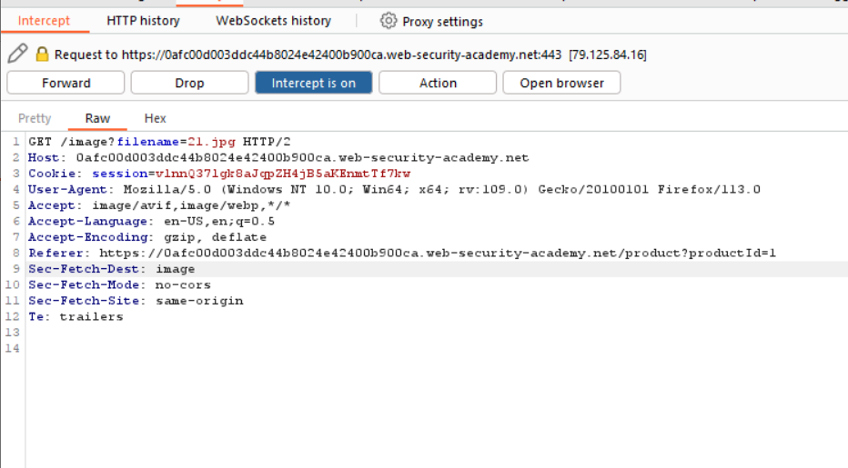
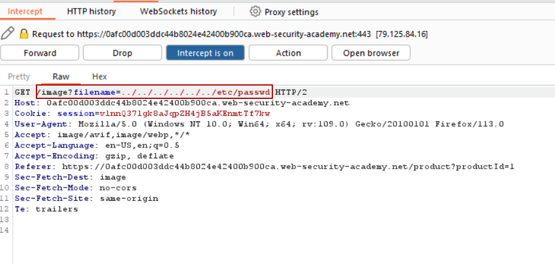
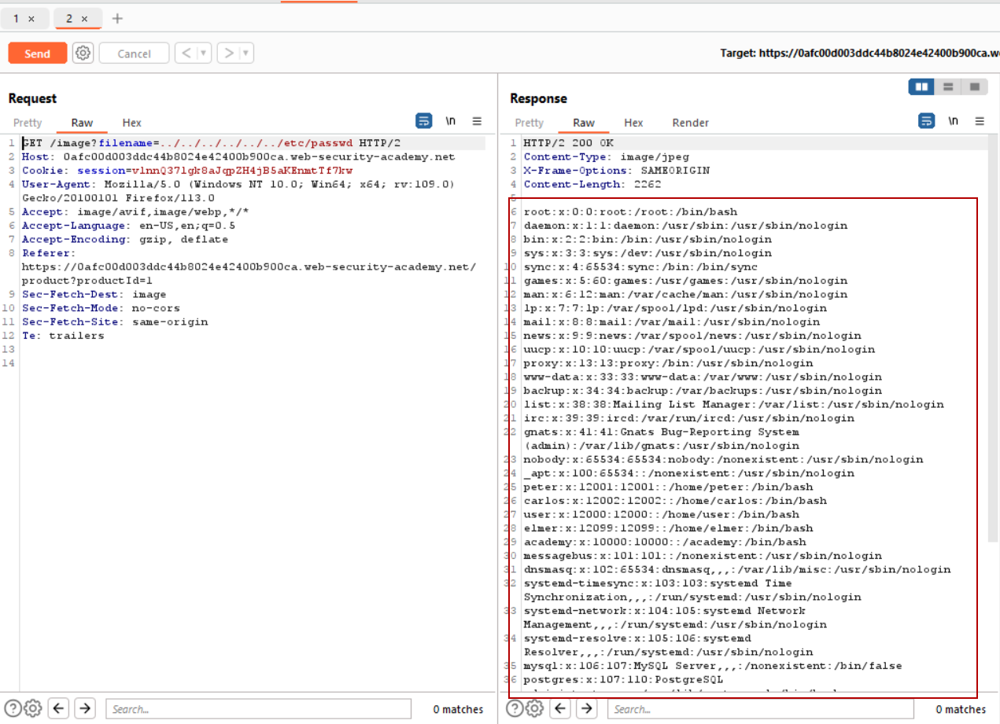

# Lab 1
##### File path traversal, simple case

## Description:
This lab contains a file path traversal vulnerability in the display of product images.
To solve the lab, retrieve the contents of the `/etc/passwd` file.

As this exercise is an apprnetice level lab, one we can assume that this application makes no effort to sanitize image paths in the html.
Simply appending `../` a certain number of times to the begining of a path to an image should be enough to view `/etc/passwd` 

When the user clicks on any of the thumbnails listed in the image above and the request is intercepted with the burp proxy, the directory traversal vulnerability can be identified when the image in the loaded post is loaded with a separate GET request from the same host.

This is exploitable because the web application loads the image within a user controllable parameter and creates a GET request to the /image path rather than just loading the image directly. The web application also does not appear to sanitize input what so ever, as a result an abitrary path can be provided to potentially sensitive information on the server.

The screenshot above shows image path was modified to reas the `/etc/passwd` file. Unfortunatly, when this request is forwarded to the browser no output is show.

However when the request sent to the burp repeater and forwarded to the browser again a second time, the result of the loading the file can be seen on the right side of the screen.

