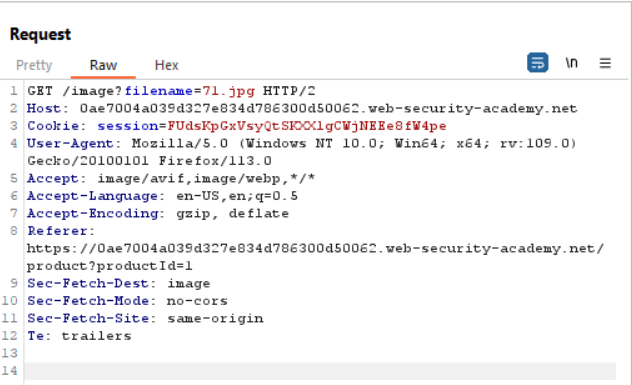
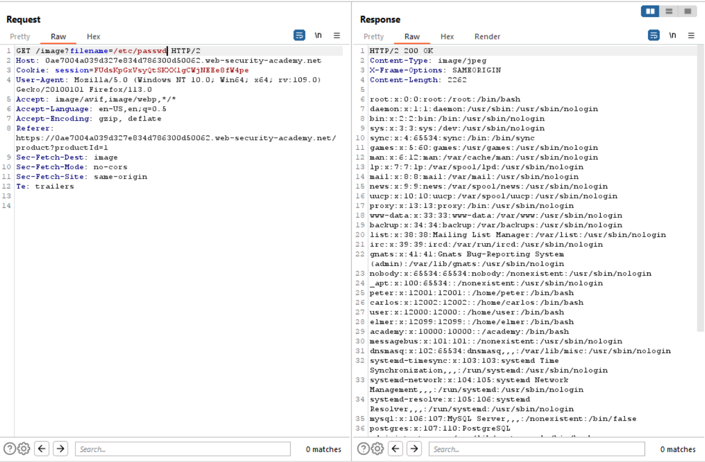

# Lab 2
##### File path traversal, traversal sequences blocked with absolute path bypass

As the the title of the lab suggests, this exercise builds on top of the last exercise with some bypass mitigations.

In order for traversal sequences to be blocked, the web application likely employs regex or some special functions that parse the input provided to the `filename` parameter and then strips the path of any characters that it deems to be malicious.

Stripping provided input of malicious characters is a common mitigation technique used by modern web applications. Though it is common for many web application will sanitize provided input, sometimes you can find applications that strip relative paths of traversal sequences but neglect stripping characters from absolute paths.

Just as in the last exercise, when the user clicks on any of posts listed in the image above, the GET request that loads the image on the page is intercepted with burp proxy and is sent to the repeater.

Instead of providing a path with traversal sequences, an absolute path to `/etc/passwd` is provided instead as seen below.

