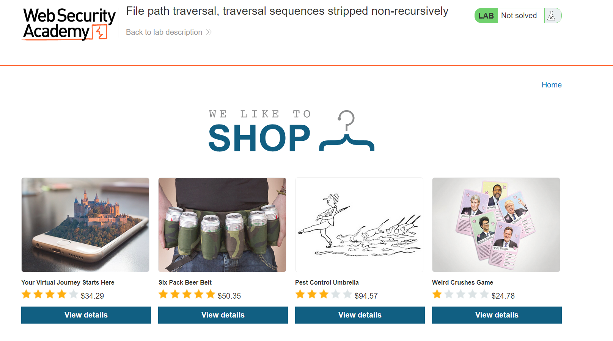
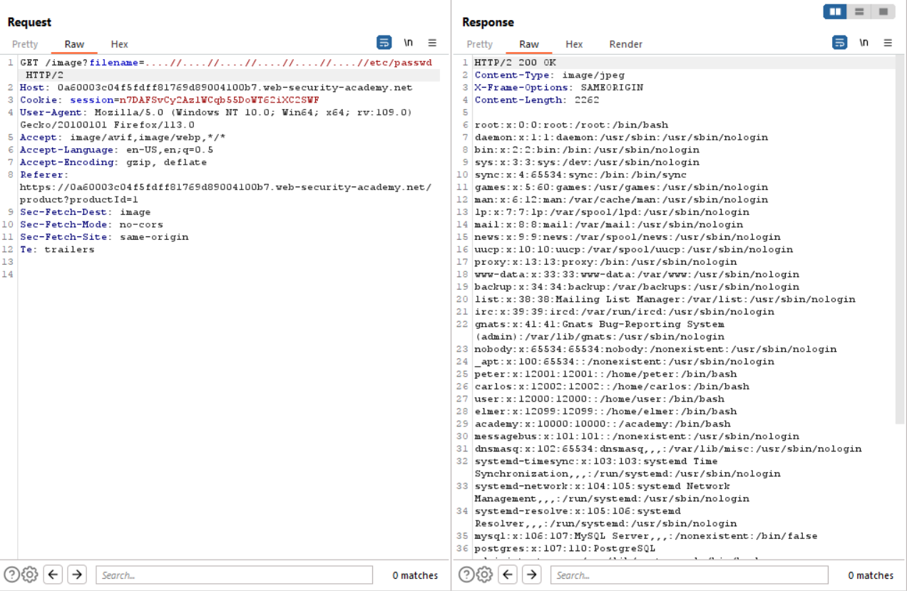

# Lab 3
##### File path traversal, traversal sequences stripped non-recursively

As the title suggests for the exercise, when provided input is not stripped in a recursive a manner, it means that once the offending characters have been removed from the string, the web application will attempt to sanitize the input and remove any more.

An example, lets say there is an application that expects to receive url encoded input from the user. Once it receives this input, the data is then url decoded and then input is then sanitized and all offending characters are moved. If this is performed in a non recursive manner, this means the user could bypass all sanitization checks by double url encoding their payload. This means that when the traversal sequences are url decoded, when the application comes to the point of sanitizing the input, it will not expect some of the payload to still be url encoded, thus bypassing sanitization checks and allowing sentive data to be read.

Whenever it comes to bypassing santization checks, a simple yet effective way of bypassing the character blacklist is to place the payload within the payload.

For example, if the goal was to execute some sql and the select statement was stripped from the provided input, the payload would look like the following `' or seSELECTlect null from table`.

Applying the same technique to traversal sequences means that the payload would look like the following `....//`. The results of this payload can be seen below.

