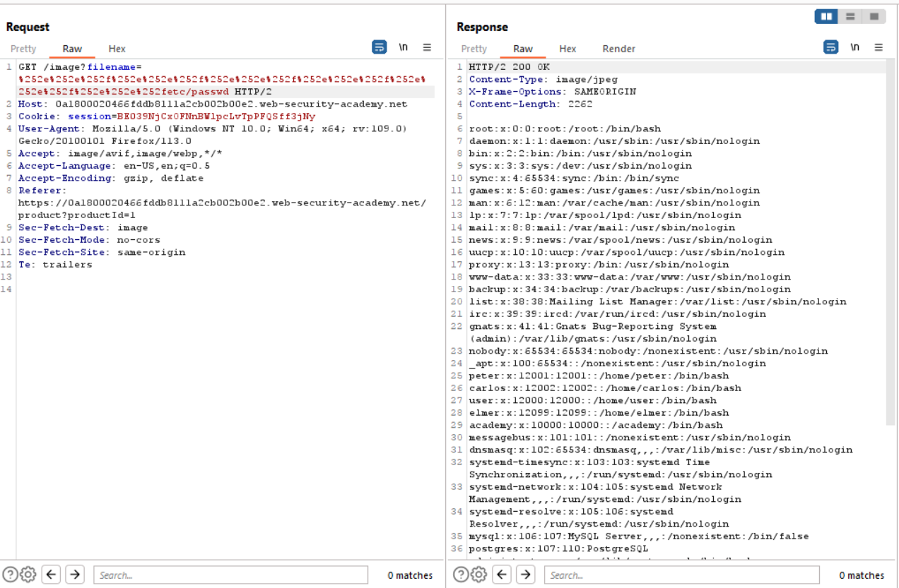

# Lab 4
##### File path traversal, traversal sequences stripped with superfluous URL-decode

As the title of the exercise suggests, all provided input is expected to be url encoded and will be stipped of all traversal sequences.

However, just as in the last exercise, the web application does not recursively sanitize the provided input. This means that in order to bypass santization checks, the solution is as simple as double url encoded traversal sequences from `%2e%2e%2f` to `%252e%252e%252f`

The results of the payload can be seen below.

