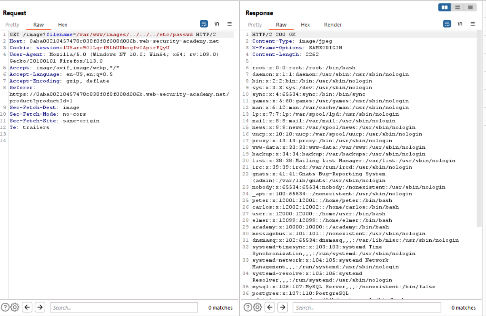

# Lab 5
##### File path traversal, validation of start of path

This next exercises focuses on web applications vulnerable to traversal attacks that focus on validating if a provided path begins with a specific base path.

The web server may see the base path as `/var/www/images` while in the actual application it may appear as `/`. in rare cases a web application may parse provided inputs in search for the base directory, while neglecting any inserted traversal sequences.

In such cases, it would be possible to traverse to `/etc/passwd` by providing the following `/var/www/images/../../../etc/passwd`

