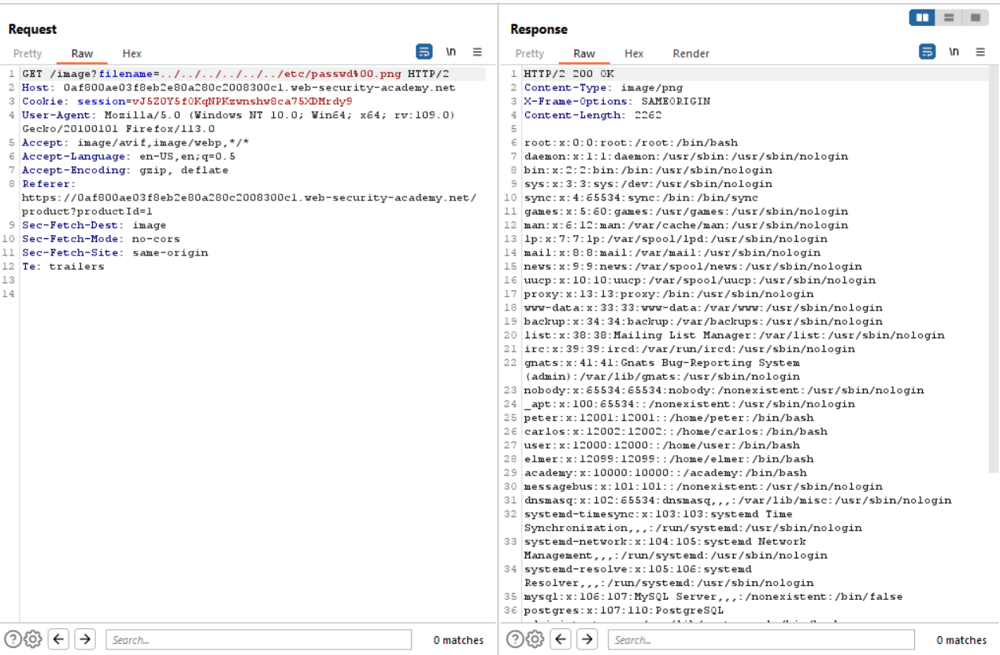

# Lab 6
##### File path traversal, validation of file extension with null byte bypass

In many old applications written in C, the `%00` or null byte character / null terminator (`\0`) is considered to the character that tells the program where the end of the string is. If it werent for this crucial piece of data at the end of string, applications would be reading and overwriting data in areas of the computer memory that it should never have access to.

Though null bytes are uncommonly seen in most web application today, there are some that will respond accordingly if provided a null byte in some form of user input.

Inserting null bytes at the end of some provided input can be used to bypass defences that look for file name extensions. A common migitation to traversal or file upload vulnerbilities in applications today, is to check the file extension of the provided file to work out whether it should be executed or not.

A web application may defend against traversal attacks by checking if the file extension is equal to that of an image.

As the application in this exercise checks if images end in `.jpeg` or `.png`, this can exploited by adding a null byte `%00` at the end of the string so that even if the provided input is concatenated with a file extension, the server will finish validating the file extension early when it hits the provided null byte.

Traversal can be exploit as seen below with the following payload `../../../../../../etc/passwd%00.png`
