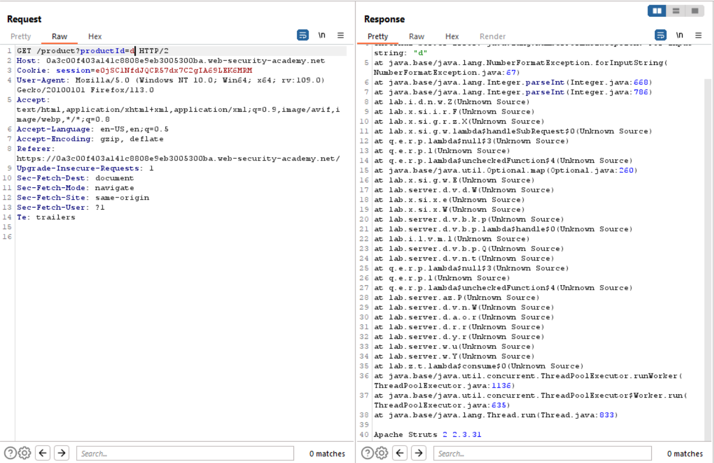

# Lab 1
##### Information disclosure in error messages

Sometimes when an application throws an exception after receiving input it didnt expect, it can disclose information to the user about the technolgies used in running the web application.

If the application if using outdated componets, being able to leak this information can be incredibley helpful to the user to know if the said componet can be exploited or not.

When the user clicks on any one of the posts in the image below, the GET request that retrives the post from the database is intercepted with burp and sent to the repeater.

Instead of entering a product id number like the application expects, an aplhanumeric value is provided instead.

The error message in the screenshot above reveals that the framework being used in this web application is Apache Struts `2 2.3.31`, which is vulnerable to a Remote Code Execution (RCE) vulnerability.

Submitting `Apache Struts 2 2.3.31` completes the lab.