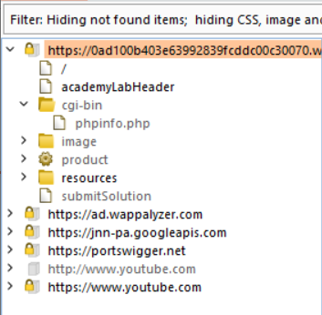
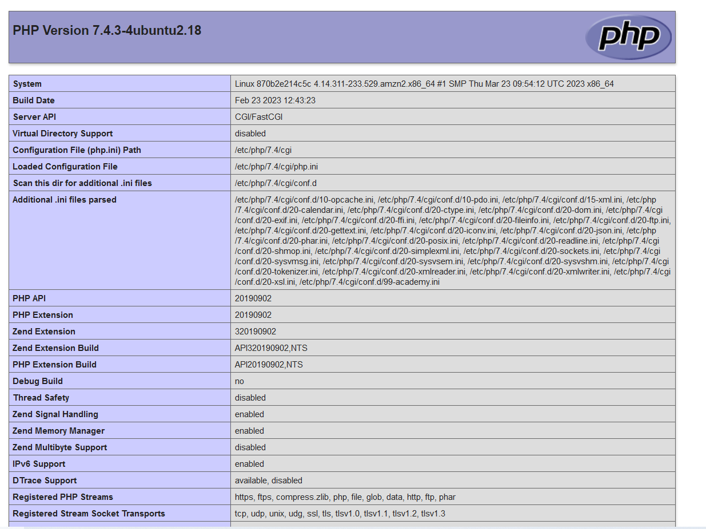
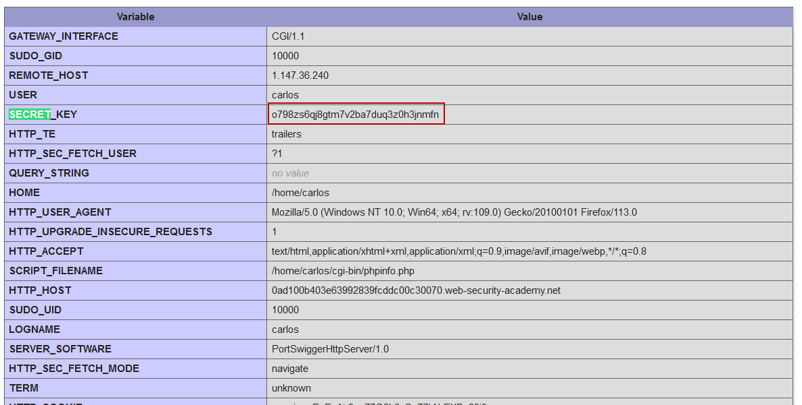

# Lab 2
##### Information disclosure on debug page

After loading the page intercepting the http traffic with burp proxy, an interesting path can be seen in the web application sitemap found in the burp interface at `Target` -> `Sitemap` named `cgi-bin/phpinfo.php`

Browsing to this page reveals a wealth of information about what plugins are enabled, application features, environment variables, internal system directory, etc.

Scrolling down the phpinfo page, the secret key required to complete the lab can be found in the servers environment variables.

The phpinfo page should always be removed the server before deploying a php application in a production enviornment.