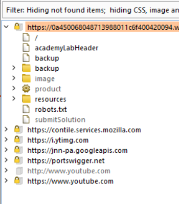
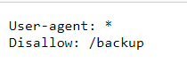
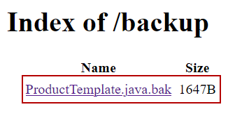
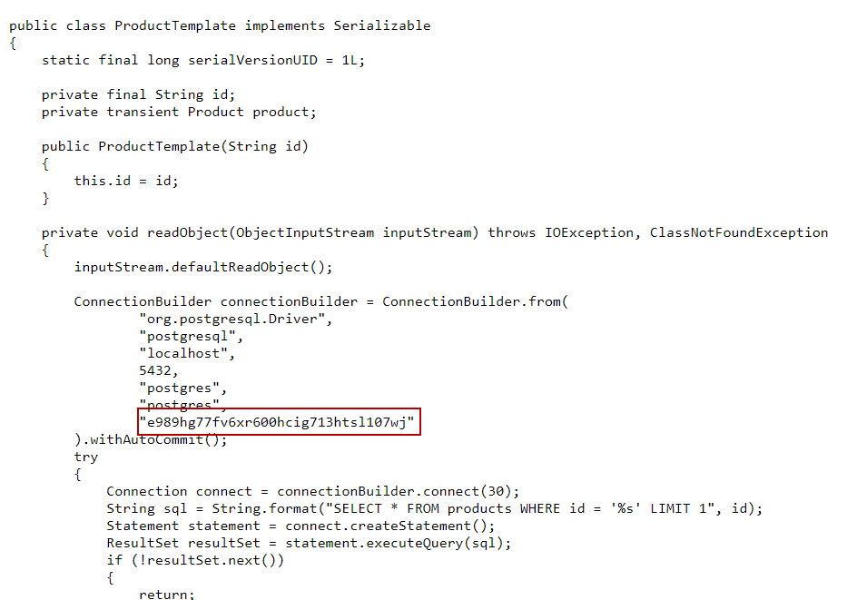

# Lab 3
##### Source code disclosure via backup files

Similar to the last exercise, this web application features some backup source code files which can be used to retrieve the database password.

This backup directory can be seen in the burp sitemap below.

The `/backup` path is also disclosed in the robots.txt file found at the root of the application.

Navigating to the `/backup` directory reveals the following file.

The database password can be seen hardcoded into the database connection string.

