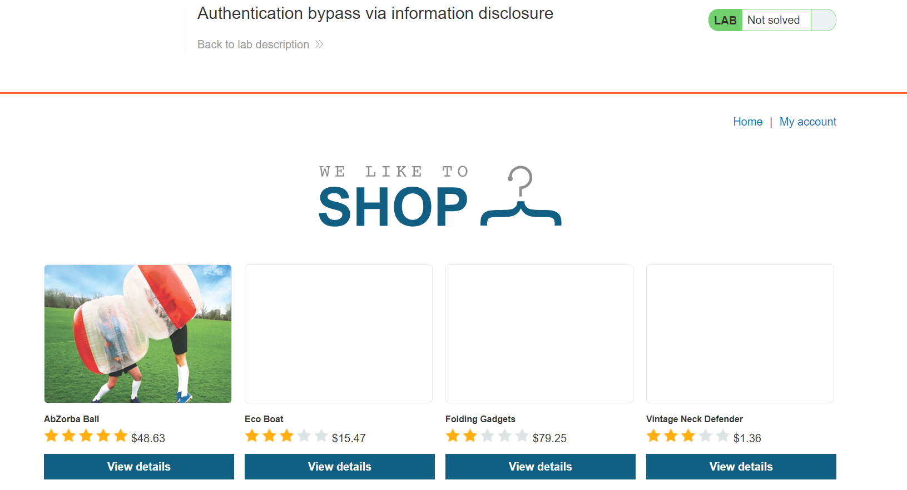
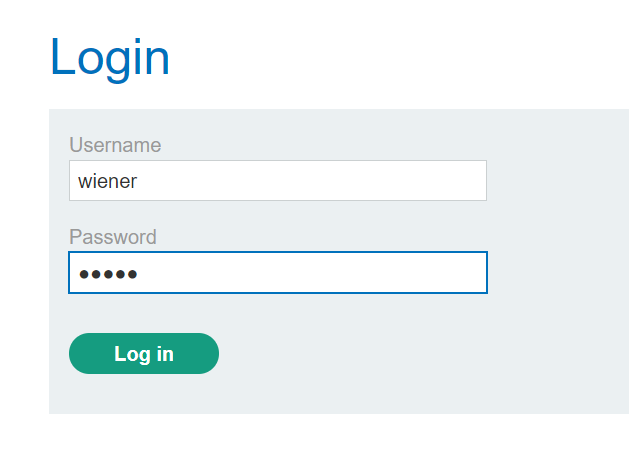
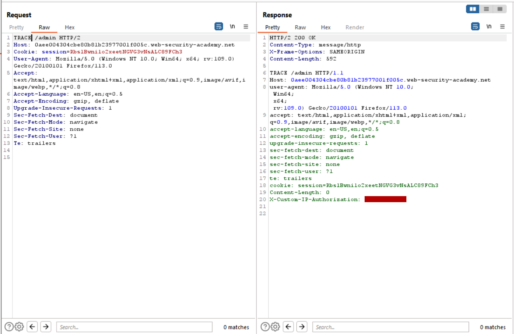
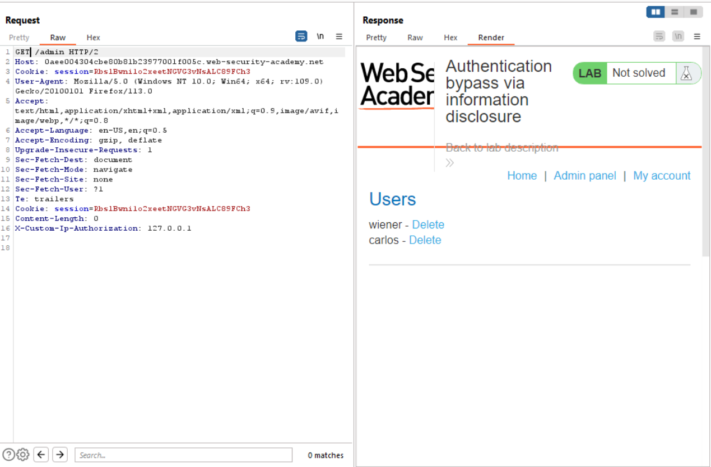
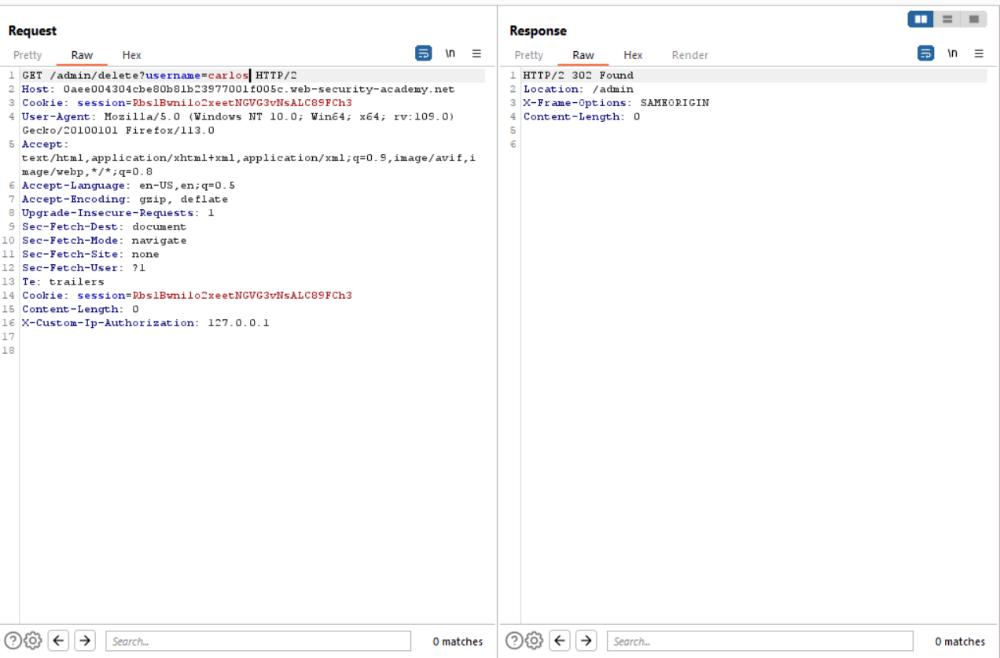

# Lab 4
##### Authentication bypass via information disclosure

After setting up burp proxy the user logs into `wiener` account using the credentials `username=wiener&password=peter`.

After logging in and attempting to the navigate to the admin panel, shows that only localhost admins can access the page.

The request in intercepted again and sent to the burp repeater. Instead of sending a GET request to `/admin`, the request method is modified to `TRACE` and is forwarded to the browser again.

This reveals some custom location based headers that must be appended to the request header in order to be authorized to access the page.

The `X-Custom-IP-Authentication` is slightly modified so that it looks like the request is originating the from the loopback address.

Forwarding the forged request allows the user access the admin.

From here, the user carlos can be deleted with `/admin/delete?username=carlos`
