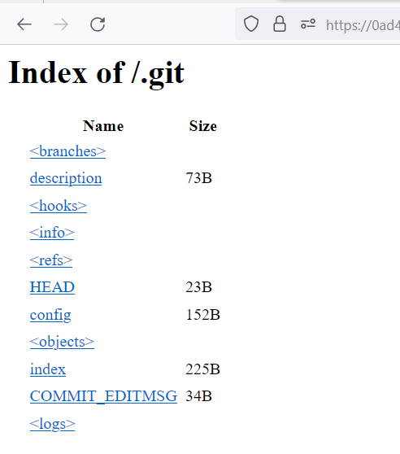
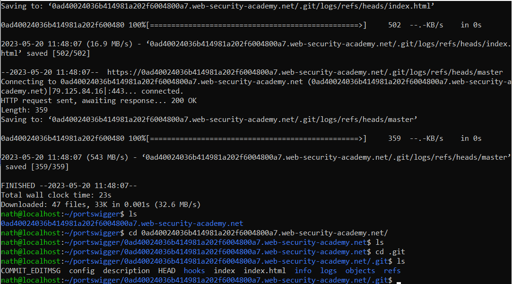
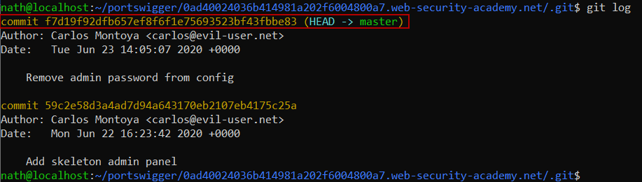
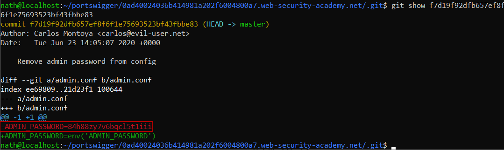
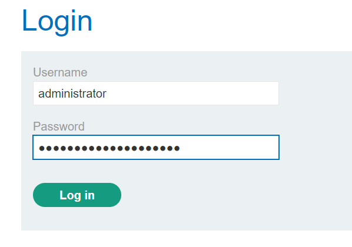
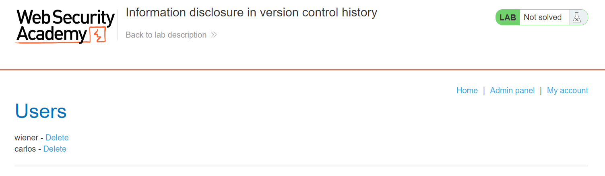

# Lab 5
##### Information disclosure in version control history

As the title suggests or alludes to, there is a .git repository that should have been removed from this application before it was moved into production.

Though this directory cannot be seen in the burp suite sitemap for the target, the .git directory can be found at the root directory of the application.

As reading the commit history in the web browser can be quite diffcult, the prefferred way to do this is download the entire .git directory and either look through each commit manually with `git log` or utilize another tool that can visual github repositories.

The directory was recursively downloaded with the following command `wget -r <https://urlOfTheWebApplication.com>`

The total list of commits can be seen with `git log`.

The contents of a commit can be viewed with the following `git show <commit-identifier>`

Once the administrators password was retrived, the user logs in as seen below.

The user carlos is then deleted.
