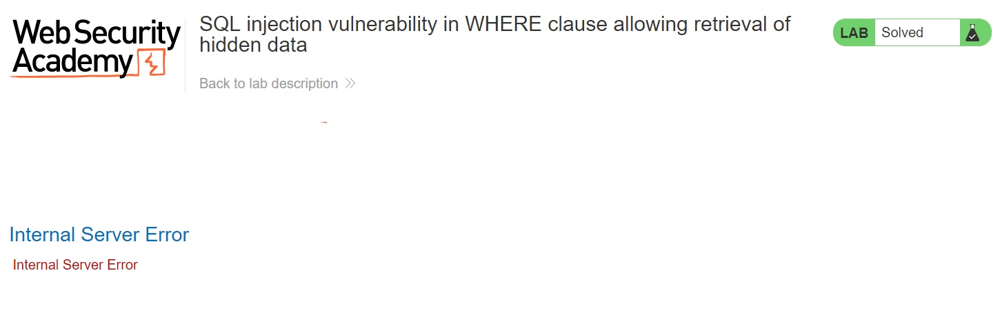
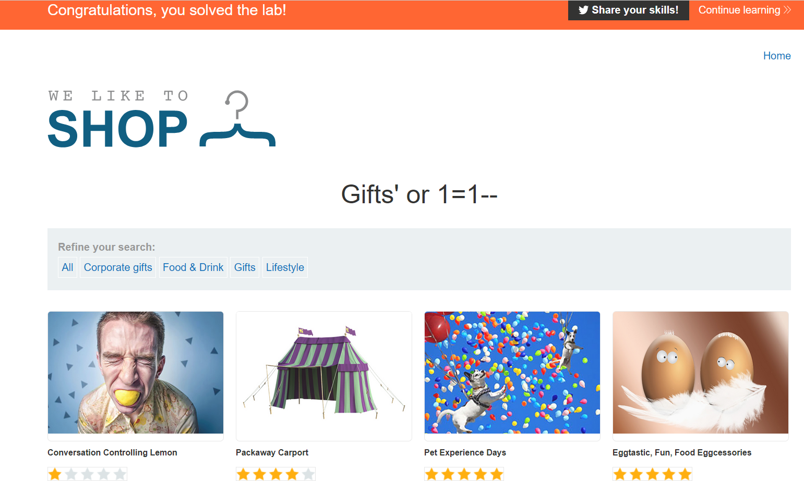

# Lab 1
##### SQL injection vulnerability in WHERE clause allowing retrieval of hidden data

When we begin the first sql injection exercise, we see the following page.

Clicking of any of the `view detail` buttons shows more information about the item on the store and shows the following in the request header `?prductid=15`.

Attempting to inject SQL into product id field returns the json response `Invalid product id`. This verfies that the vulnerability isn't in the productid parameter.

However, when I click on any one of the item categories under `refine your search`, we can successfully inject SQL into the category parameter with the following `?category=Gifts'+or+1=1`.

Though this fails with an internal server error, it shows that paremeter is injectable.

After some messing around I found that the rest of the line needed to be commented out with `--` and requires no semicolon at the end of the query.

