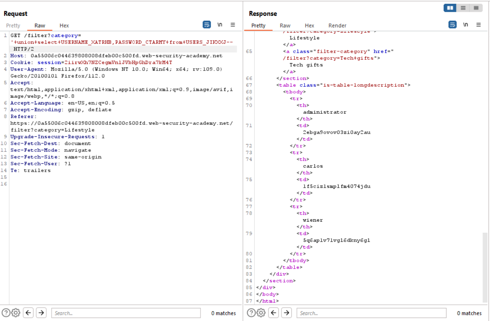

# Lab 10
##### SQL injection attack, listing the database contents on Oracle

This exercise is the same as lab 9 with the exception that I need to escalate to the admin user on OracleDB this time instead of mysql.


Given that tables names are column names are a little bit different on OracleDB, this required a few google searches before I found that I could search for all tables using the following payload `'+union+select+table_name,owner+from+all_tables--`.

The `owner` field is eqivelent to the table_schema field in mysql, but at the time that I was completing this exercise I had no idea that was the case. The screenshots below shows me using filtering filtering through the results with `ctrl+f` on my browser before I found the table `USERS_JIKXXJ` with the schema name `peter`.


Another google search revealed that I was able to find the column names of the users table with the following `'+union+select+column_name,owner+from+all_tab_columns+where+table_name+=+'USERS_JIKXXJ'--`.


Here I grab the Administrators username and password `'+union+select+USERNAME_XATRHB,PASSWORD_CTARMY+from+USERS_JIKXXJ--`.


```bash
credentials

username: Administrator
password: 2ebga9ovov03zi0ay2au
```

Success!
