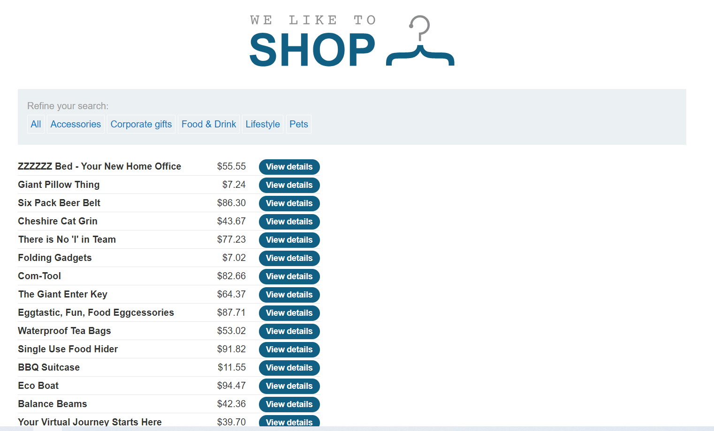
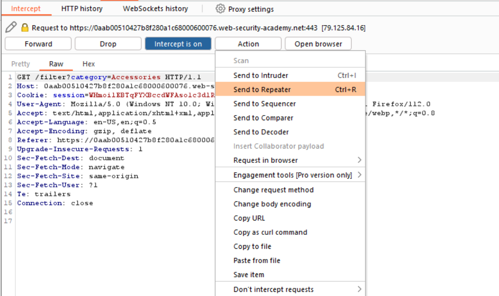
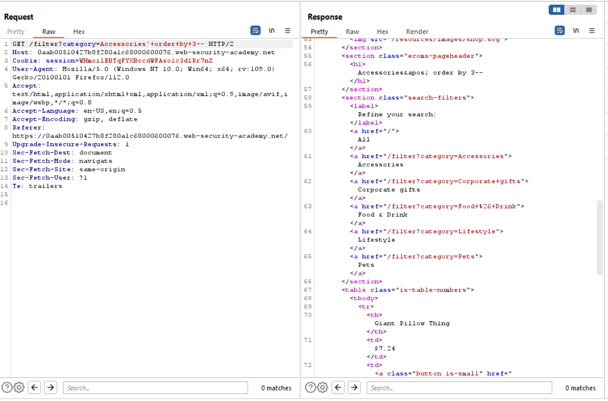
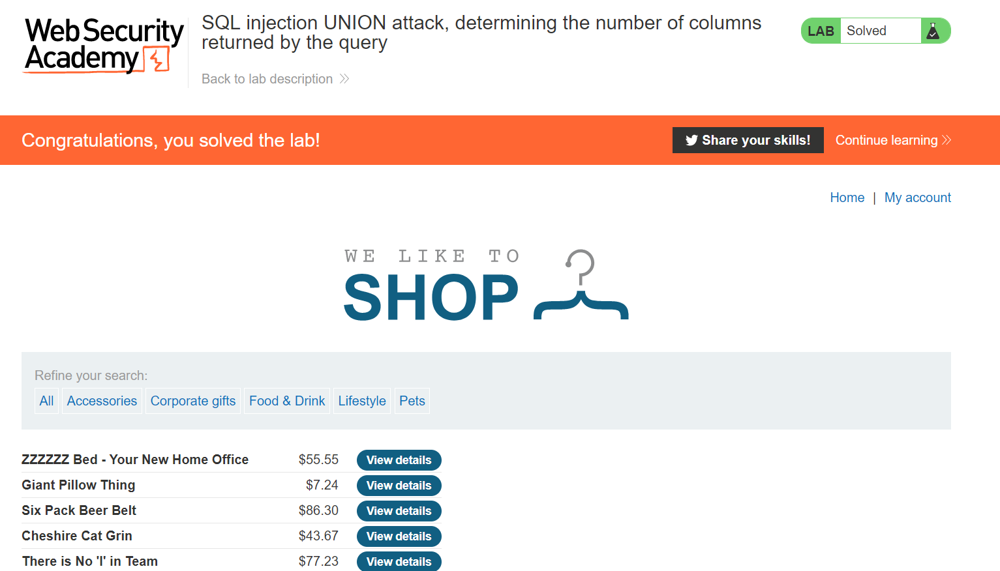

# Lab 3
##### SQL injection UNION attack, determining the number of columns returned by the query

This exercise should be a little more diffcuilt as the first 2, as it requires to determine how many columns are being returned from the SQL query.

There 2 ways you can do this, but there is a specific way that the exercise wants us to use. I will demonstrate the first technique and then the second, being the answer.

Clicking on any of the category links will show the injectable parameter in the request header. After I capture the request I send it to the repeater so I can keep resending the same request over and over without having to recapture the request.

## Method 1: Order By
The first method I use to determine the number of columns is by using the `order by` statement. The `order by` keyword allows the database to sort results depending on ascending or descending order. Adding a value like `1` will sort the results by the first column in the query.

The idea is to keep incrementing the number columns that `order by` sorts until we reach an error message.

By using this technique, I can see that there are 3 columns because on the forth column we got an internal error.

## Method 2: Union Select
The `union select` allows an addtional sql query to execute along side the original query. The idea behind using `union select` is to specify each potential column name as `null`. Until the server successfully executes the query you will have to keep adding `null` columns to your select statement until the query is successful.

I can also verify that there are 3 columns as when I injection the following query, I no longer get an error `'+union+select+null,null,null`
