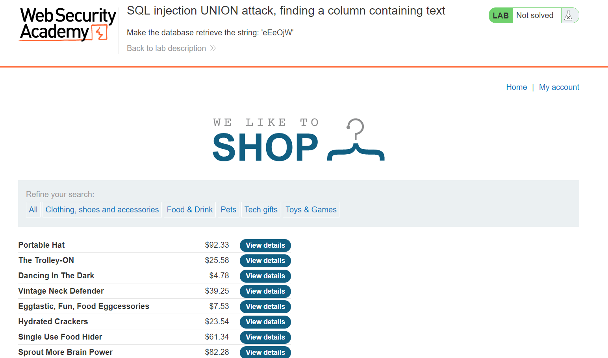
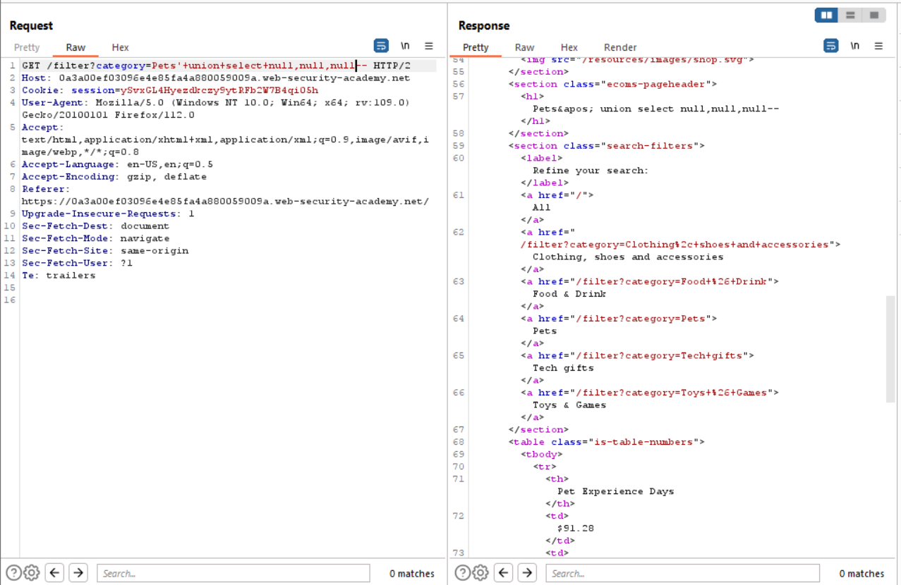
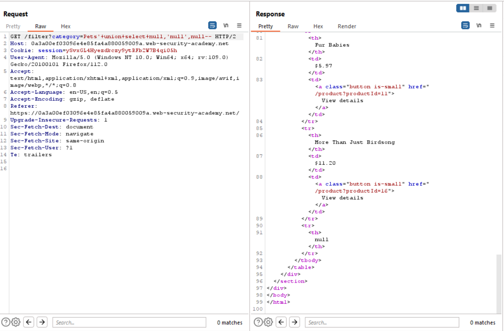
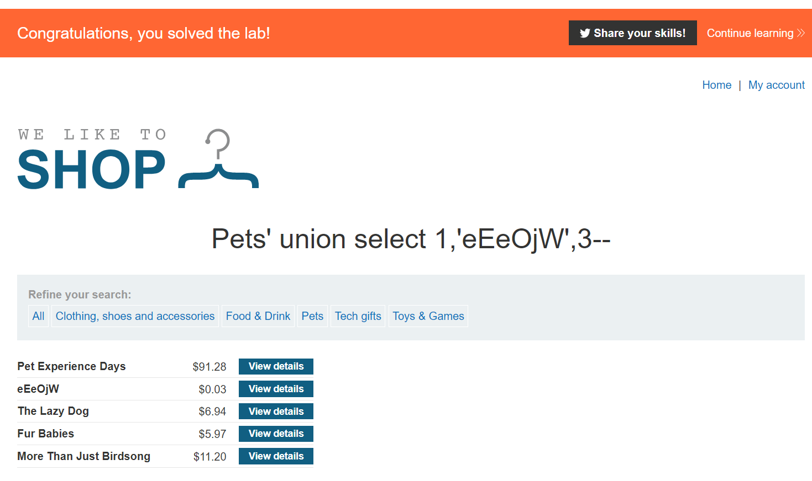

# Lab 4
##### SQL injection UNION attack, finding a column containing text

Building on top of what we know from the last few sql injection exercises, lab 4 asks us to find which particular column in the returned results from the database contains text.

After finding the column that contains text, we need to get the database to use the column we found to display a randomly generated string. The block of text that I need to display using the database (`eEeOjW`) is marked under the title in the screenshot above.

This can be achived using the `union select` statement as used in previous exercises. However before I can work out which columns are numbers or strings, I need to use the techniques used in the last exercise to work out how many columns there are.

The screenshot above shows that the server is still returning 3 columns as in the last exercise.

We can work out what columns contain numbers or text by indivudally sorrounding each `null` column with quotation marks and sending the request. If we get an error, then something is wrong.

For example: I could test the parameter like so.
`'+union+select+'null',null,null--`

If this test fails, move on the next parameter.
`'+union+select+null,'null',null--`

In the screenshot below you can see that middle null column is the text column.

If I change the payload to `'+union+select+1,'eEeOjW',3--`, you can see below that the exercise has successfully been completed.

