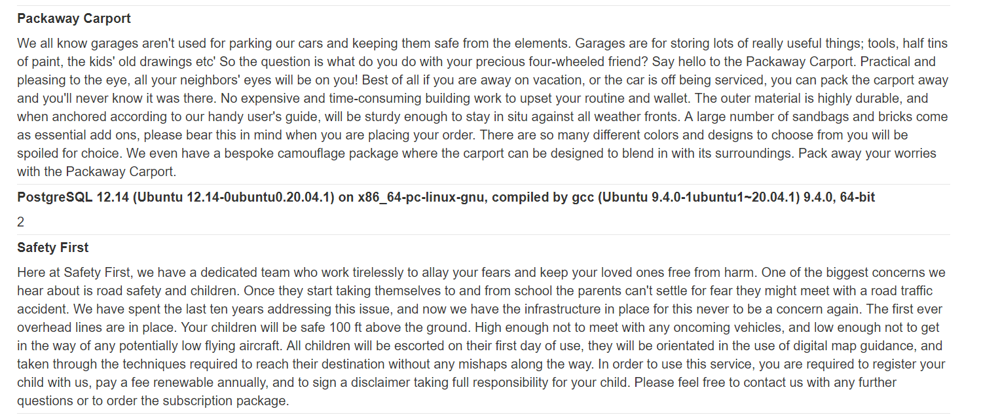

# Lab 5
##### SQL injection UNION attack, retrieving data from other tables

For this exercise I'm going to take a slightly different approach then what the PortSwigger intented (atleast for this exercise).

The exercise page when we launch the lab pretty much tells that we need to query usernames and passwords from a users table within the same database. However, if this was a real pentest, there would be no garentee that a `users` table what exist, atleast it might have a different name.

Thats why I want to go about this lab in a way where I can discover the users table + the column names for myself before stealing the administrator credentials.

First of all, I want to know the version of the database I'm working so I can research how to find and access the `users` table.

Mysql and T-sql database use the `@@version` command while postgresql uses `version()`. Oracle on the other hand has an entire table dedicated to holding the version called `v$version`

After sending this payload to the server `Lifestyle'+union+select+version(),'2'--` we can see below that the server is running `postgresql`

A google search reveals that postgresql uses a simular schema to mysql and microsoft databases that hold statistics about all tables and columns across all databases. Much like mysql and tsql databases, this schema is known as the `information_schema` and all tables can be accessed with the following query `select table_name,x,y,z from information_schema.tables`

In the screenshot you can see that I query all tables in the database with a similar query `'+union+select+table_name,table_schema+from+information_schema.tables--`.

As there are a lot of results to filter through, I'm going to narrow down the search by only searching for tables in `public` schema. This should remove all of the statistical / default databases and tables that come with postgresql from flooding the results. Using the following query I refine the search `'+union+select+table_name,''+from+information_schema.tables+where+table_schema+=+'public'--`

This gets me the results below.

Now that I have access to the users table, assuming I didn't know what the column names are, I can access them by modifying my last request `'+union+select+column_name,''+from+information_schema.columns+where+table_name+=+'users'--`

As we can see in the query below, the `users` table only has 2 fields `username` and `password`. If this was a more realistic example we would likely see other columns containing hashes, information about the user, whether the account is locked out or disabled, what group of users it is part of, etc.

Now that I have the `users` table and its column names, I can complete the exercise the way PortSwigger designed it to be completed.

To access the administrators password I used the following query `'+union+select+username,password+from+users--`

Upon logging in with the administrators accounts I see the following.
