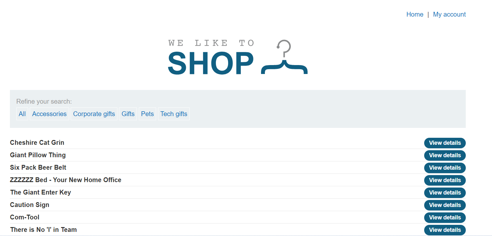
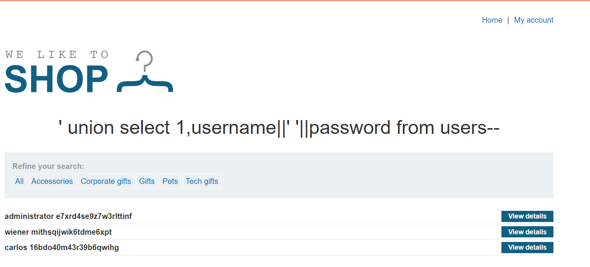

# Lab 6
##### SQL injection UNION attack, retrieving multiple values in a single column

If you have not already worked out what this lab is about going by its title, pretty much I will be convering string concatenation.

This exercise is virtually the same as the last exercise, however I will have to demonstrate how to fit the username and password in one column.

Using techniques learned in earlier exercises, I found that results returned by the database only includes 2 columns and one of them is a number, and the other is a string. This can be verified with the following payload `'+union+select+1,'data'+from+users--`

Thanks to PortSwigger for providing students with an sql injection [cheat sheet](https://portswigger.net/web-security/sql-injection/cheat-sheet), as this makes it a little easier to work out how string can be concatenated between each database.

Oracle and Postgres use `||` to concatenate strings while t-sql uses the `+` character. In mysql it is unclear whether a space is used for concatenation, however if not, mysql can use the `concat()` function instead.

As the database is running Postgres, I crafted the following payload `'+union+select+1,username||'%20'||password+from+users--`.

The results of the query are below.

Upon logging in, we complete the exercise.