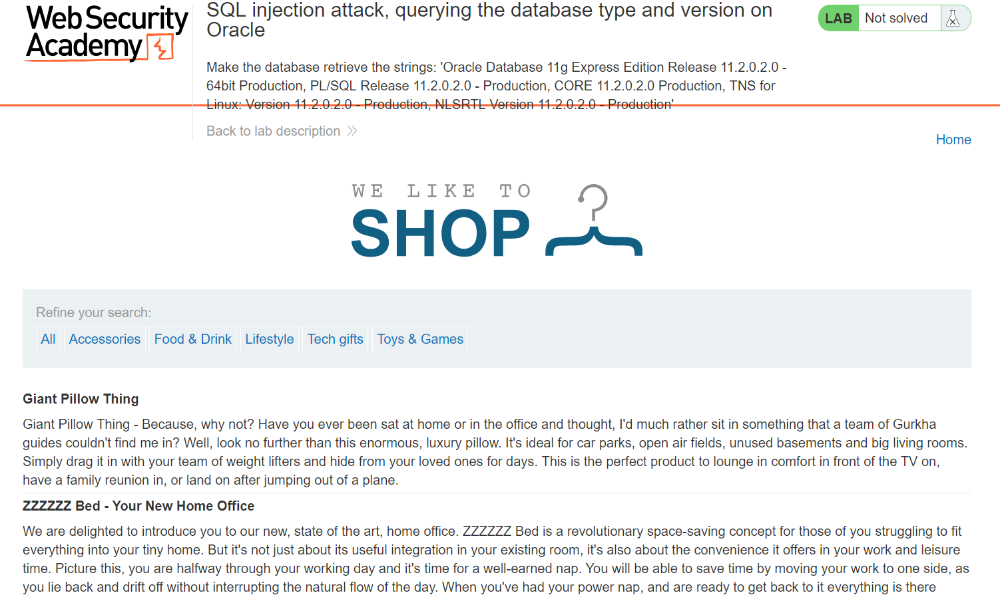
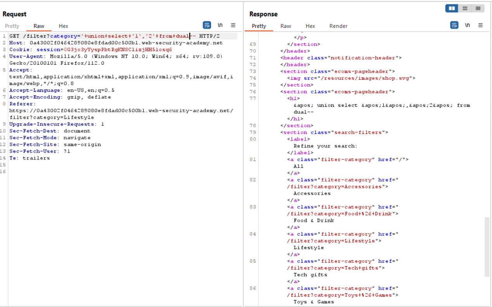
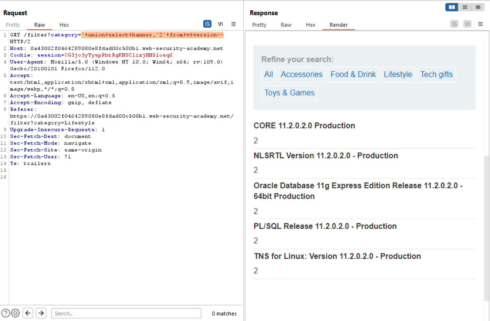

# Lab 7
##### SQL injection attack, querying the database type and version on Oracle

As seen in the screenshot below, in this lab I need to exploit SQL Injection on a database running OracleDB.

Unlike other databases like tsql, mysql and postgres and sqlite, in order to retrieve version information the user needs query the data from a table rather than calling a function.

The same applies for testing the returned column fields from an SQL query. In order to test column field, the user needs to query tbe `dual` table.

The screenshot below, you can see that 2 fields in the SQL are injectable are that both of them are strings.
`'+union+select+'1','2'+from+dual--`

By slightly modifying the query I was able to print the version information of the OracleDB to the screen with the following payload.
`'+union+select+banner,'2'+from+v$version--`
