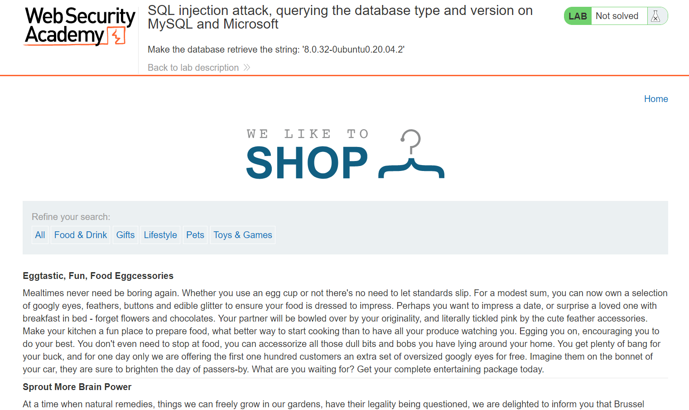
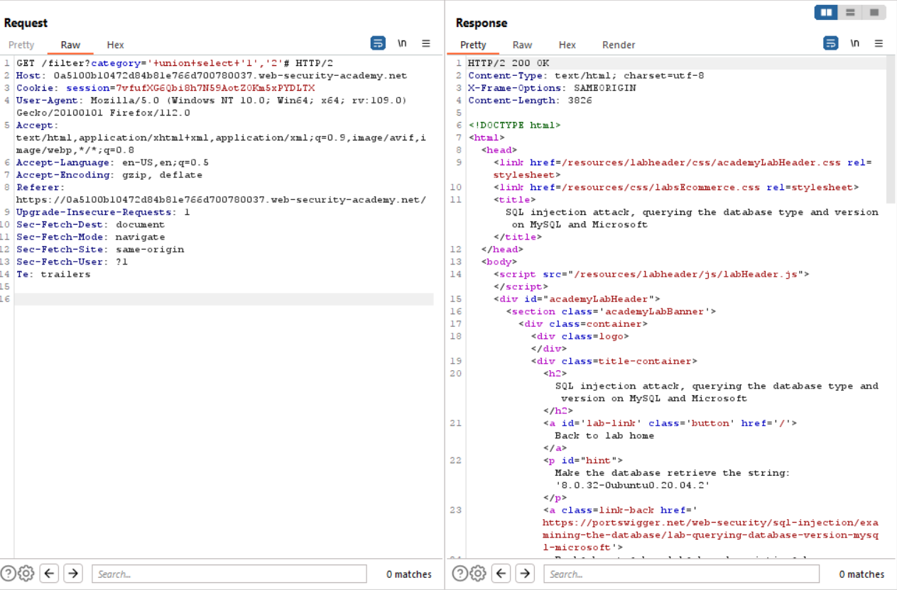
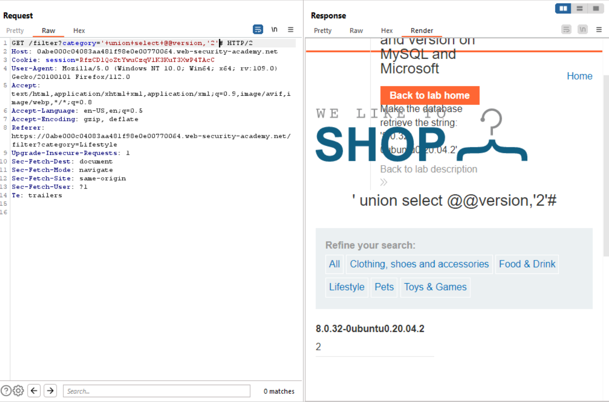

# Lab 8
##### SQL injection attack, querying the database type and version on MySQL and Microsoft

Analyzing the title of this exercise shows that the objective is the same as lab 7, except that we are query version information on mysql / tsql databases.

As you can see, the SQL query column types are the same as the lab 7. The only difference in this query is that the rest of the line is commented out with the `#`character instead of a double `--`.

Using the following `'+union+select+@@version,'2'#` I return the version of the DB to the screen.
