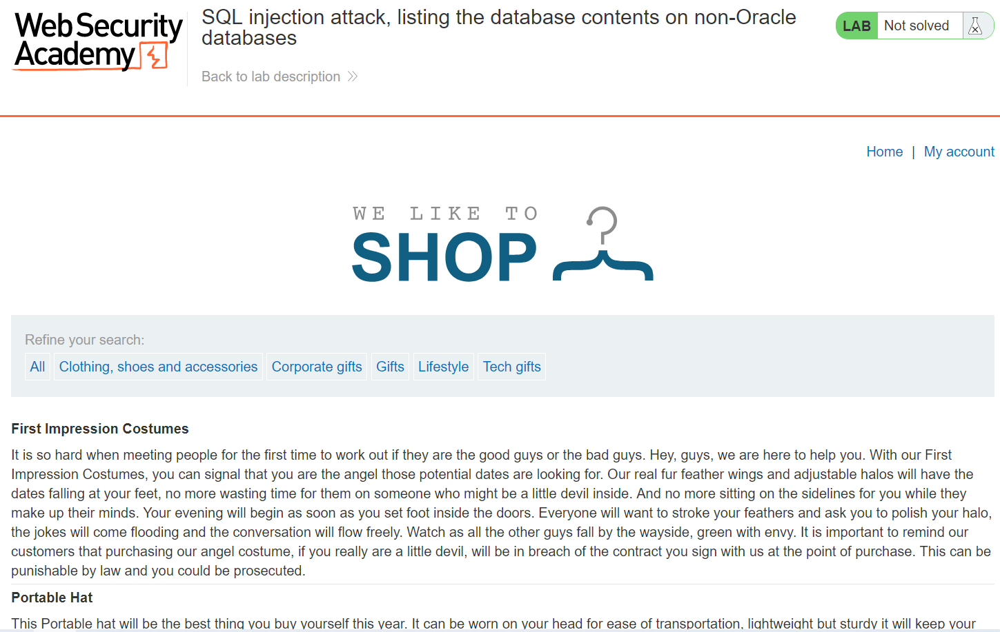
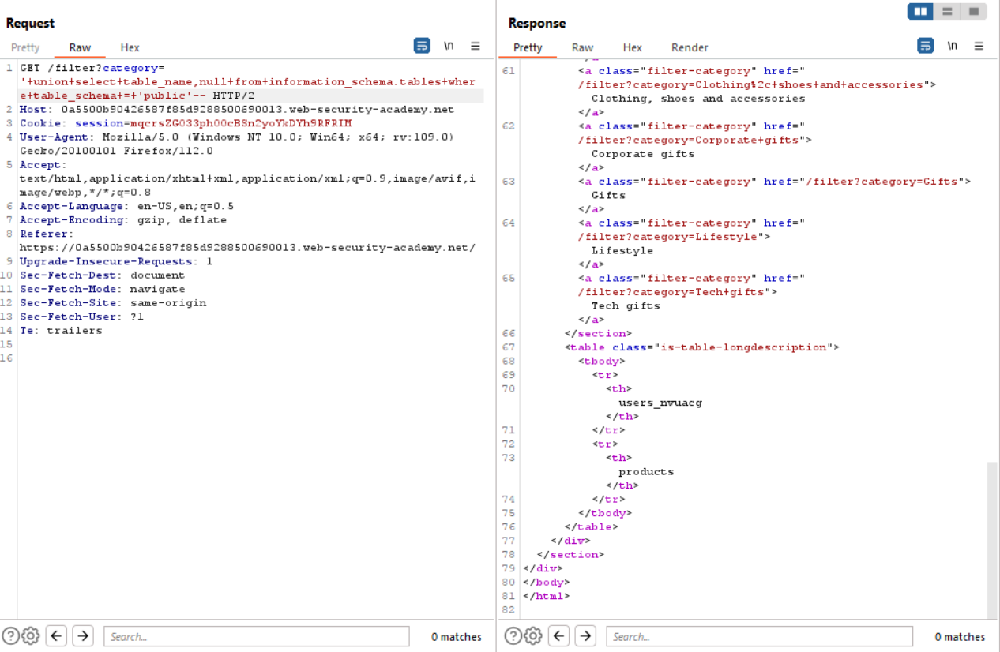
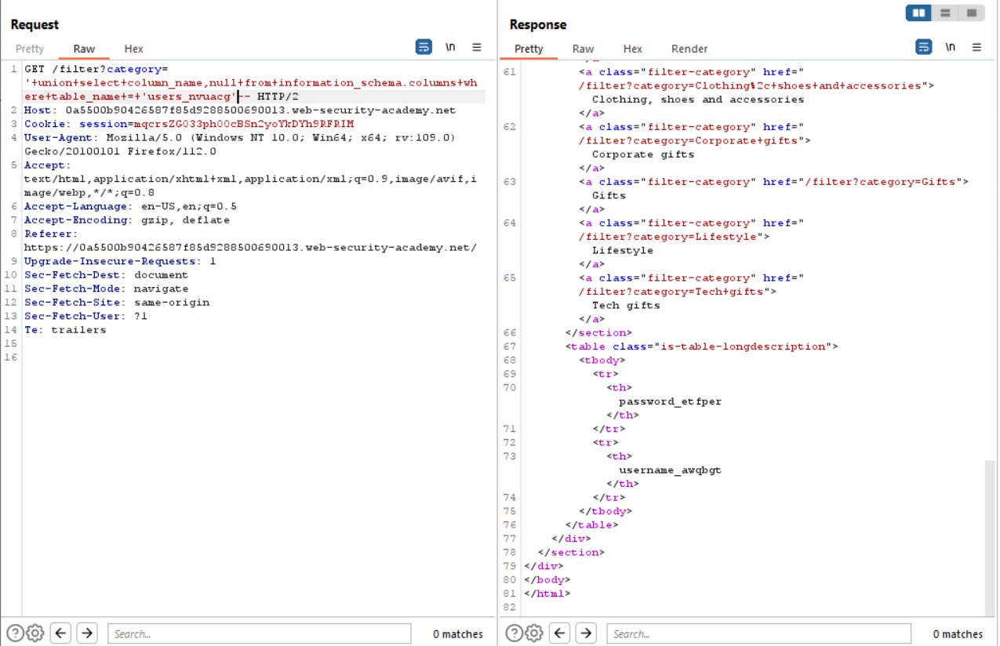
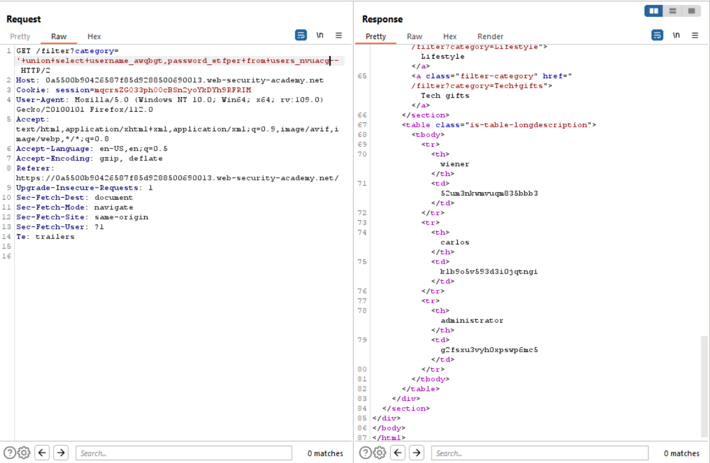
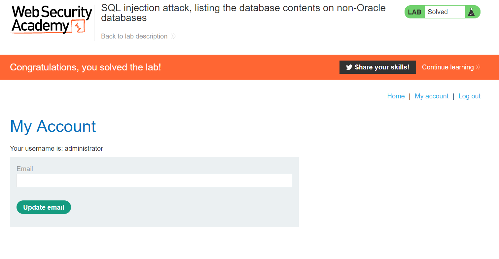

# Lab 9
##### SQL injection attack, listing the database contents on non-Oracle databases

In this exercise, the user needs to be able to list all tables in the database and find the `users` table. From here we then need to find find what columns `users` table has in order to access the credentials to the `administrator` user. Luckily I practically already completed this exercise back in lab 5.



Using techniques in earlier exercises I quickly worked out that the 2 injectable columns are strings.
By querying the information_schema and filtering out the results by the table_schema with the following payload `'+union+select+table_name,null+from+information_schema.tables+where+table_schema+=+'public'--` I found that the users table had been renamed to `users_nvuacg`


Using the table name I found I then created the following query to discover the new username column field names `'+union+select+column_name,null+from+information_schema.columns+where+table_name+=+'users_nvuacg'--`.

The results from this query showed that the usernamed and passwor field has been renamed to `username_awqbgt` and `password_etfper`.


Using this information I constructed the following query and retrieved the admin password `'+union+select+username_awqbgt,password_etfper+from+users_nvuacg--`.


```bash
credentials

username: Administrator
password: g2fsxu3vyh0xpswp6mc5
```

Below shows that I successfully login.
