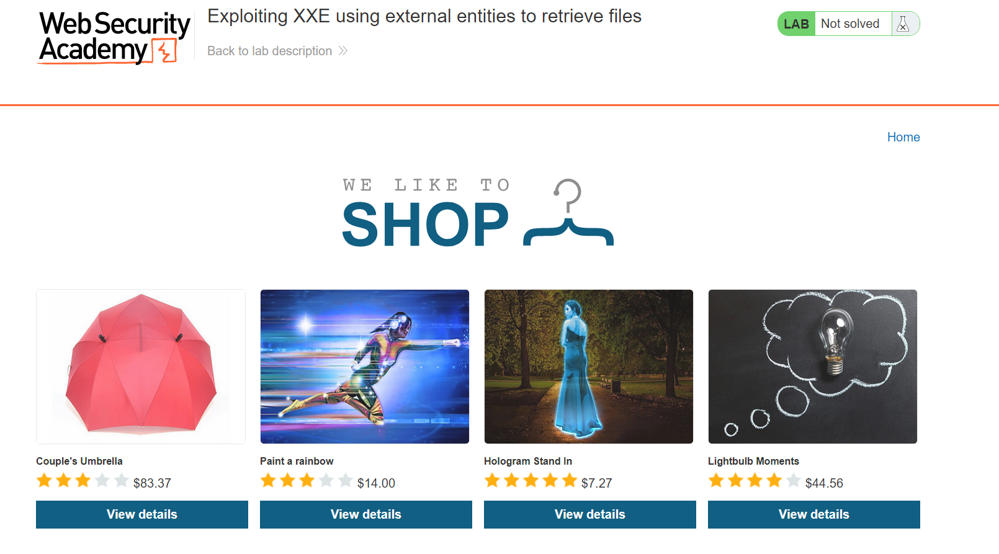
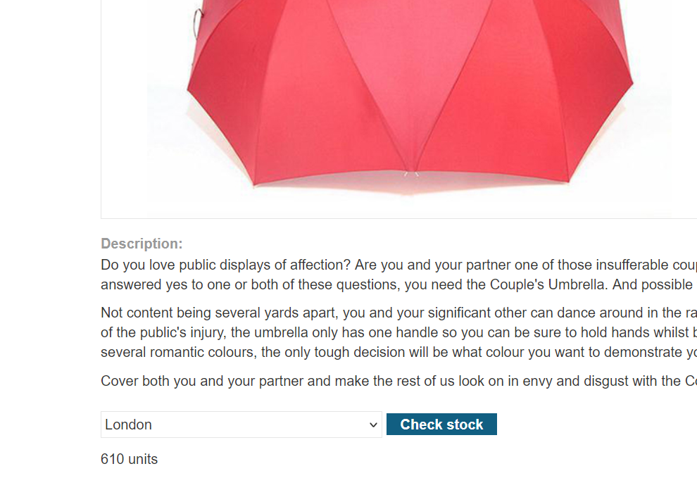
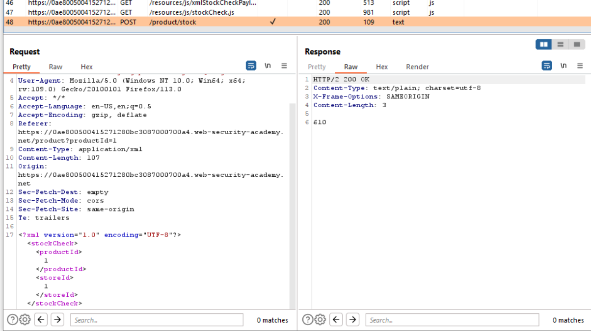
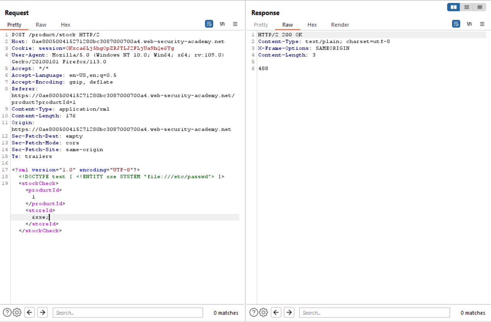
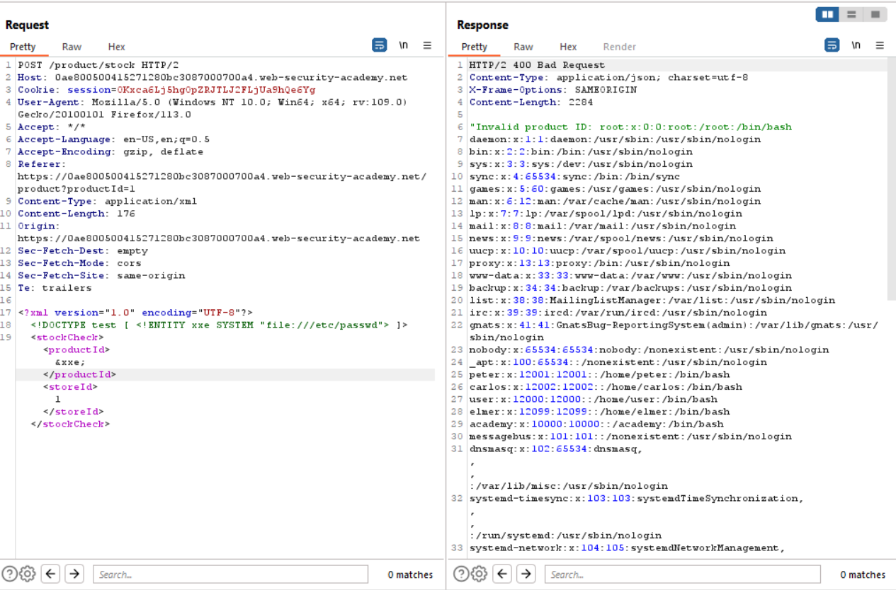

# Lab 1
##### Exploiting XXE using external entities to retrieve files

According to the burpsuite exercise page for this particular lab, there is a vulnerability located in the "check stock" feature located under any one of the items that can purchased through the web application.

The "check stock" feature can be seen in the screenshot above. However, when the user intercepts the request with burp proxy the following xml can be seen in the POST request.

From here, the user checks if the stockid parameter is vulnerable to XXE injection. This is done by inserting the following xml entity to see if the contents of a file can be accessed from the server and returned in the HTTP request.

Though the results aren't anything ground breaking, it is interesting to note that the stock amount is different even though the input value for the storeid isn't a number.

When the user attempts to check if the product id field will show the results of the xml entity, the following can be seen.

