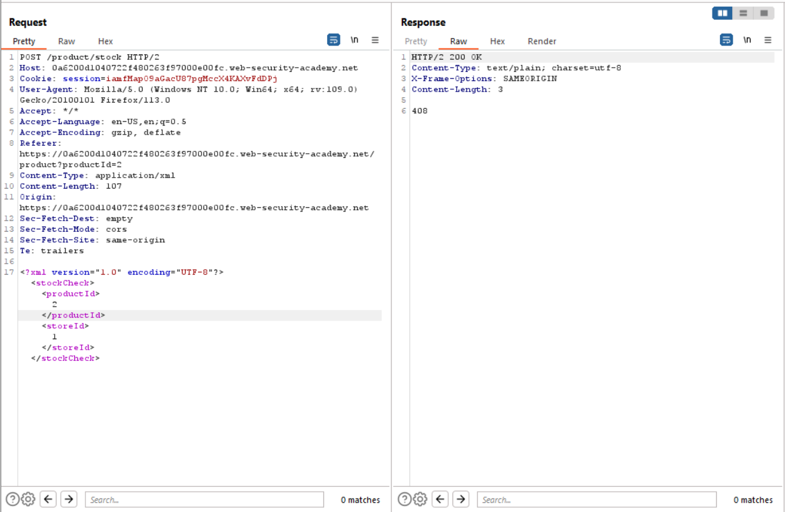

# Lab 1
##### Exploiting XXE to perform SSRF attacks

Just as `lab 1`, this exercise has a similar XXE vulnerability located in the "check stock" feature as seen in the screenshot above. However this exercise is about utilizing XXE Injection to exploit SSRF.

As seen in the image above, the xml that is submitted in the request is virtually the same as the last exercise. Here the user inserts an xml entity and attempts to contact the following internal server address `http://169.254.169.254/`.

When the user submits a request that contacts the internal server address via XXE, an interesting error message containing the name of a directory is returned. When the user appends the name of the directory to the request and forwards it to the browser, another sub directory name can be seen in the error message.

This process is repeated until the user is able to access the file that contains the Administrators secret key as seen below.

