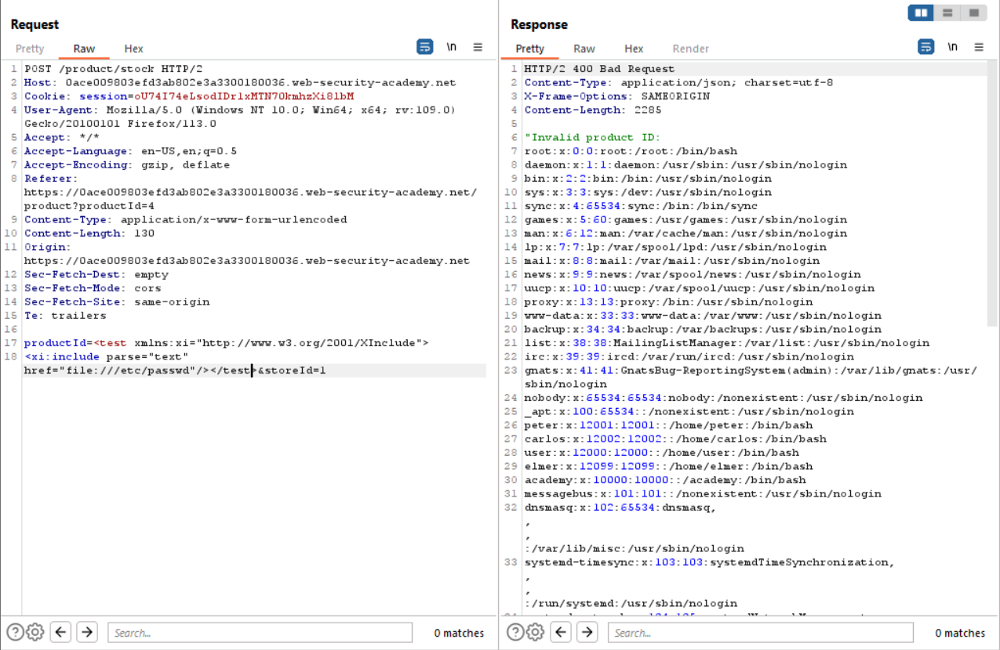

# Lab 1
##### Exploiting XInclude to retrieve files

As in the last few exercise, this lab has a vulnerability located in the "check stock" feature, however at first glance there does not appear to be any xml that is submitted in the request.

However, when the Xinclude feature is utilized to include `/etc/passwd` on the local system, the user is able to read internal files on the server without the need of inserting or creating an xml entity.

