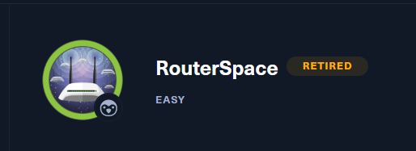

# Router Space Writeup



Target host: 10.10.11.148
Performed TCP portscan
```go
└──╼ $rustscan -a 10.10.11.148 -- -sV -sC -A
.----. .-. .-. .----..---.  .----. .---.   .--.  .-. .-.
| {}  }| { } |{ {__ {_   _}{ {__  /  ___} / {} \ |  `| |
| .-. \| {_} |.-._} } | |  .-._} }\     }/  /\  \| |\  |
`-' `-'`-----'`----'  `-'  `----'  `---' `-'  `-'`-' `-'
The Modern Day Port Scanner.
________________________________________
: http://discord.skerritt.blog           :
: https://github.com/RustScan/RustScan :
 --------------------------------------
Nmap? More like slowmap.🐢

[~] The config file is expected to be at "/home/nath/.rustscan.toml"
[!] File limit is lower than default batch size. Consider upping with --ulimit. May cause harm to sensitive servers
[!] Your file limit is very small, which negatively impacts RustScan's speed. Use the Docker image, or up the Ulimit with '--ulimit 5000'. 
Open 10.10.11.148:22
Open 10.10.11.148:80
[~] Starting Script(s)
[>] Running script "nmap -vvv -p {{port}} {{ip}} -sV -sC -A" on ip 10.10.11.148
Depending on the complexity of the script, results may take some time to appear.
[~] Starting Nmap 7.92 ( https://nmap.org ) at 2023-04-13 11:13 AEST
NSE: Loaded 155 scripts for scanning.
NSE: Script Pre-scanning.
NSE: Starting runlevel 1 (of 3) scan.
Initiating NSE at 11:13
Completed NSE at 11:13, 0.00s elapsed
NSE: Starting runlevel 2 (of 3) scan.
Initiating NSE at 11:13
Completed NSE at 11:13, 0.00s elapsed
NSE: Starting runlevel 3 (of 3) scan.
Initiating NSE at 11:13
Completed NSE at 11:13, 0.00s elapsed
Initiating Ping Scan at 11:13
Scanning 10.10.11.148 [2 ports]
Completed Ping Scan at 11:13, 0.29s elapsed (1 total hosts)
Initiating Parallel DNS resolution of 1 host. at 11:13
Completed Parallel DNS resolution of 1 host. at 11:13, 0.03s elapsed
DNS resolution of 1 IPs took 0.03s. Mode: Async [#: 1, OK: 0, NX: 1, DR: 0, SF: 0, TR: 1, CN: 0]
Initiating Connect Scan at 11:13
Scanning 10.10.11.148 [2 ports]
Discovered open port 80/tcp on 10.10.11.148
Discovered open port 22/tcp on 10.10.11.148
Completed Connect Scan at 11:13, 0.55s elapsed (2 total ports)
Initiating Service scan at 11:13
Scanning 2 services on 10.10.11.148
Completed Service scan at 11:14, 45.80s elapsed (2 services on 1 host)
NSE: Script scanning 10.10.11.148.
NSE: Starting runlevel 1 (of 3) scan.
Initiating NSE at 11:14
Completed NSE at 11:14, 14.55s elapsed
NSE: Starting runlevel 2 (of 3) scan.
Initiating NSE at 11:14
Completed NSE at 11:14, 0.97s elapsed
NSE: Starting runlevel 3 (of 3) scan.
Initiating NSE at 11:14
Completed NSE at 11:14, 0.00s elapsed
Nmap scan report for 10.10.11.148
Host is up, received syn-ack (0.32s latency).
Scanned at 2023-04-13 11:13:56 AEST for 63s

PORT   STATE SERVICE REASON  VERSION
22/tcp open  ssh     syn-ack (protocol 2.0)
| fingerprint-strings: 
|   NULL: 
|_    SSH-2.0-RouterSpace Packet Filtering V1
| ssh-hostkey: 
|   3072 f4:e4:c8:0a:a6:af:66:93:af:69:5a:a9:bc:75:f9:0c (RSA)
| ssh-rsa AAAAB3NzaC1yc2EAAAADAQABAAABgQDTJG10LrPb/oV0/FaR2FprNXTVtRobg1Jwy5UOJGrzjWqI8lNDf5DDi3ilSdkJZ0+0Rwr4/gKG5UlyvqCz07XrPfnWG+E7NrgpMpVKR4LF9fbX750gxK+hOSco3qQclv3CUTjTzwMgxf0ltyOg6WJvThYQ3CFDDeOc4T27YqQ/VgwBT92PWu6aZgWX2oAn+X8/fdcejGWeumU9b+rufiNt/pQ1dGUz+wkHeb2pIaA4WfEQLHB1xF33rTZuAXFDiKSb35EpPvhuShsMPQv6Q+NfLAiENgdy+UdybSNH6k1gmPHyroSYoXth7Pelpg+38V9SYtvvoxQRqBbaLApEClTnIM/IvQba9vY8VdfKYDGDcgeuPm8ksnOFPrb5L6axwl0K2ngE4VHQBJM0yxIRo5dELswD1c9O1tR2rq6MbW2giPl6dx/xzEbdVV6VO5n/prjsnpEs8YvNmnELrt6mt0FkcJQ9ageN5ji3pecKxKTVY4J71yf4+cVZKwpX8xI5H6E=
|   256 7f:05:cd:8c:42:7b:a9:4a:b2:e6:35:2c:c4:59:78:02 (ECDSA)
| ecdsa-sha2-nistp256 AAAAE2VjZHNhLXNoYTItbmlzdHAyNTYAAAAIbmlzdHAyNTYAAABBBDiksdoNGb5HSVU5I64JPbS+qDrMnHaxiFkU+JKFH9VnP69mvgdIM9wTDl/WGjeWV2AJsl7NLQQ4W0goFL/Kz48=
|   256 2f:d7:a8:8b:be:2d:10:b0:c9:b4:29:52:a8:94:24:78 (ED25519)
|_ssh-ed25519 AAAAC3NzaC1lZDI1NTE5AAAAIP2psOHQ+E45S1f8MOulwczO6MLHRMr+DYtiyNM0SJw8
80/tcp open  http    syn-ack
|_http-title: RouterSpace
|_http-favicon: Unknown favicon MD5: CFB063F352B240F3BEF6572157EA9AE4
| fingerprint-strings: 
|   FourOhFourRequest: 
|     HTTP/1.1 200 OK
|     X-Powered-By: RouterSpace
|     X-Cdn: RouterSpace-49001
|     Content-Type: text/html; charset=utf-8
|     Content-Length: 68
|     ETag: W/"44-9+/dvaa3O3UQtFG1fPQPTuhJwTo"
|     Date: Thu, 13 Apr 2023 01:14:09 GMT
|     Connection: close
|     Suspicious activity detected !!! {RequestID: e y9 Sv CwBQp lZ S }
|   GetRequest: 
|     HTTP/1.1 200 OK
|     X-Powered-By: RouterSpace
|     X-Cdn: RouterSpace-72314
|     Accept-Ranges: bytes
|     Cache-Control: public, max-age=0
|     Last-Modified: Mon, 22 Nov 2021 11:33:57 GMT
|     ETag: W/"652c-17d476c9285"
|     Content-Type: text/html; charset=UTF-8
|     Content-Length: 25900
|     Date: Thu, 13 Apr 2023 01:14:04 GMT
|     Connection: close
|     <!doctype html>
|     <html class="no-js" lang="zxx">
|     <head>
|     <meta charset="utf-8">
|     <meta http-equiv="x-ua-compatible" content="ie=edge">
|     <title>RouterSpace</title>
|     <meta name="description" content="">
|     <meta name="viewport" content="width=device-width, initial-scale=1">
|     <link rel="stylesheet" href="css/bootstrap.min.css">
|     <link rel="stylesheet" href="css/owl.carousel.min.css">
|     <link rel="stylesheet" href="css/magnific-popup.css">
|     <link rel="stylesheet" href="css/font-awesome.min.css">
|     <link rel="stylesheet" href="css/themify-icons.css">
|   HTTPOptions: 
|     HTTP/1.1 200 OK
|     X-Powered-By: RouterSpace
|     X-Cdn: RouterSpace-28304
|     Allow: GET,HEAD,POST
|     Content-Type: text/html; charset=utf-8
|     Content-Length: 13
|     ETag: W/"d-bMedpZYGrVt1nR4x+qdNZ2GqyRo"
|     Date: Thu, 13 Apr 2023 01:14:05 GMT
|     Connection: close
|     GET,HEAD,POST
|   RTSPRequest, X11Probe: 
|     HTTP/1.1 400 Bad Request
|_    Connection: close
| http-methods: 
|_  Supported Methods: GET HEAD POST OPTIONS
|_http-trane-info: Problem with XML parsing of /evox/about
2 services unrecognized despite returning data. If you know the service/version, please submit the following fingerprints at https://nmap.org/cgi-bin/submit.cgi?new-service :
==============NEXT SERVICE FINGERPRINT (SUBMIT INDIVIDUALLY)==============
SF-Port22-TCP:V=7.92%I=7%D=4/13%Time=6437575C%P=x86_64-pc-linux-gnu%r(NULL
SF:,29,"SSH-2\.0-RouterSpace\x20Packet\x20Filtering\x20V1\r\n");
==============NEXT SERVICE FINGERPRINT (SUBMIT INDIVIDUALLY)==============
SF-Port80-TCP:V=7.92%I=7%D=4/13%Time=6437575C%P=x86_64-pc-linux-gnu%r(GetR
SF:equest,19D7,"HTTP/1\.1\x20200\x20OK\r\nX-Powered-By:\x20RouterSpace\r\n
SF:X-Cdn:\x20RouterSpace-72314\r\nAccept-Ranges:\x20bytes\r\nCache-Control
SF::\x20public,\x20max-age=0\r\nLast-Modified:\x20Mon,\x2022\x20Nov\x20202
SF:1\x2011:33:57\x20GMT\r\nETag:\x20W/\"652c-17d476c9285\"\r\nContent-Type
SF::\x20text/html;\x20charset=UTF-8\r\nContent-Length:\x2025900\r\nDate:\x
SF:20Thu,\x2013\x20Apr\x202023\x2001:14:04\x20GMT\r\nConnection:\x20close\
SF:r\n\r\n<!doctype\x20html>\n<html\x20class=\"no-js\"\x20lang=\"zxx\">\n<
SF:head>\n\x20\x20\x20\x20<meta\x20charset=\"utf-8\">\n\x20\x20\x20\x20<me
SF:ta\x20http-equiv=\"x-ua-compatible\"\x20content=\"ie=edge\">\n\x20\x20\
SF:x20\x20<title>RouterSpace</title>\n\x20\x20\x20\x20<meta\x20name=\"desc
SF:ription\"\x20content=\"\">\n\x20\x20\x20\x20<meta\x20name=\"viewport\"\
SF:x20content=\"width=device-width,\x20initial-scale=1\">\n\n\x20\x20\x20\
SF:x20<link\x20rel=\"stylesheet\"\x20href=\"css/bootstrap\.min\.css\">\n\x
SF:20\x20\x20\x20<link\x20rel=\"stylesheet\"\x20href=\"css/owl\.carousel\.
SF:min\.css\">\n\x20\x20\x20\x20<link\x20rel=\"stylesheet\"\x20href=\"css/
SF:magnific-popup\.css\">\n\x20\x20\x20\x20<link\x20rel=\"stylesheet\"\x20
SF:href=\"css/font-awesome\.min\.css\">\n\x20\x20\x20\x20<link\x20rel=\"st
SF:ylesheet\"\x20href=\"css/themify-icons\.css\">\n\x20")%r(HTTPOptions,10
SF:8,"HTTP/1\.1\x20200\x20OK\r\nX-Powered-By:\x20RouterSpace\r\nX-Cdn:\x20
SF:RouterSpace-28304\r\nAllow:\x20GET,HEAD,POST\r\nContent-Type:\x20text/h
SF:tml;\x20charset=utf-8\r\nContent-Length:\x2013\r\nETag:\x20W/\"d-bMedpZ
SF:YGrVt1nR4x\+qdNZ2GqyRo\"\r\nDate:\x20Thu,\x2013\x20Apr\x202023\x2001:14
SF::05\x20GMT\r\nConnection:\x20close\r\n\r\nGET,HEAD,POST")%r(RTSPRequest
SF:,2F,"HTTP/1\.1\x20400\x20Bad\x20Request\r\nConnection:\x20close\r\n\r\n
SF:")%r(X11Probe,2F,"HTTP/1\.1\x20400\x20Bad\x20Request\r\nConnection:\x20
SF:close\r\n\r\n")%r(FourOhFourRequest,12A,"HTTP/1\.1\x20200\x20OK\r\nX-Po
SF:wered-By:\x20RouterSpace\r\nX-Cdn:\x20RouterSpace-49001\r\nContent-Type
SF::\x20text/html;\x20charset=utf-8\r\nContent-Length:\x2068\r\nETag:\x20W
SF:/\"44-9\+/dvaa3O3UQtFG1fPQPTuhJwTo\"\r\nDate:\x20Thu,\x2013\x20Apr\x202
SF:023\x2001:14:09\x20GMT\r\nConnection:\x20close\r\n\r\nSuspicious\x20act
SF:ivity\x20detected\x20!!!\x20{RequestID:\x20\x20e\x20y9\x20Sv\x20\x20CwB
SF:Qp\x20lZ\x20S\x20}\n");

NSE: Script Post-scanning.
NSE: Starting runlevel 1 (of 3) scan.
Initiating NSE at 11:14
Completed NSE at 11:14, 0.00s elapsed
NSE: Starting runlevel 2 (of 3) scan.
Initiating NSE at 11:14
Completed NSE at 11:14, 0.00s elapsed
NSE: Starting runlevel 3 (of 3) scan.
Initiating NSE at 11:14
Completed NSE at 11:14, 0.00s elapsed
Read data files from: /usr/bin/../share/nmap
Service detection performed. Please report any incorrect results at https://nmap.org/submit/ .
Nmap done: 1 IP address (1 host up) scanned in 63.89 seconds
```